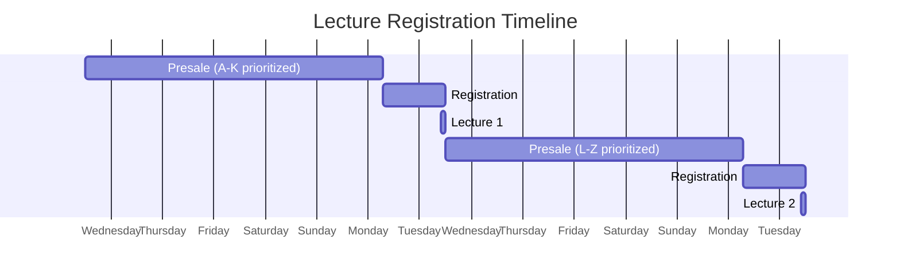
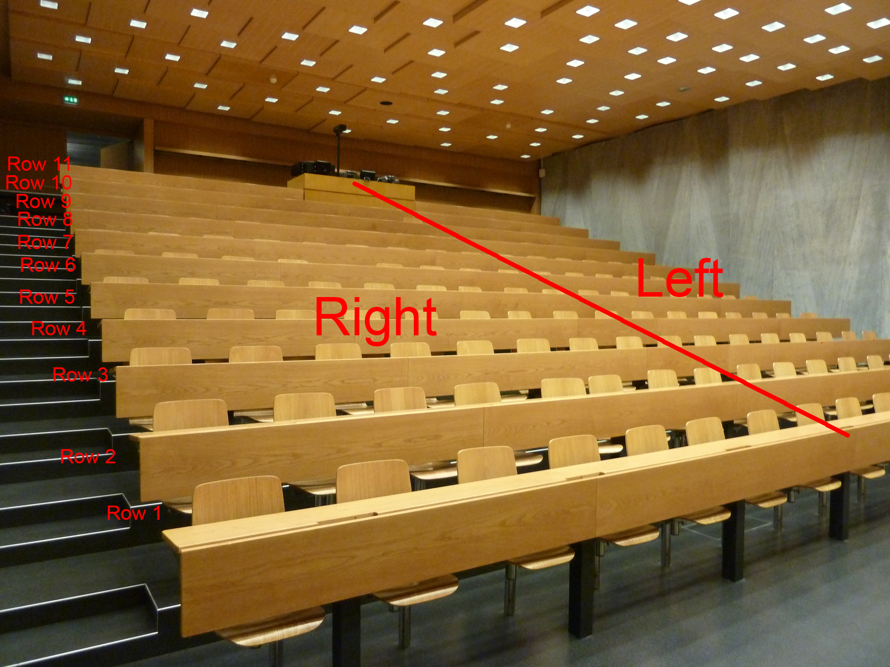

# Network Security (NetSec) 2020 User Manual

Welcome to the NetSec course! This GitLab project wil serve as the main point of (online) interaction between students
and the course team. Concretely, using this project you will

- receive lecture materials such as slides, exercises, and old exams;
- be able to ask question about lecture content, projects, administrative issues, ...;
- have the ability to hand in your exercise sheets and get feedback on them; and
- be able to apply for a _lecture ticket_, which will allow you to visit the lectures at ETH in person.

Each of these items are discussed in more detail below.

## Lecture Tickets

### Lecture Registration

Because we will not be able to use the lecture halls to full capacity this semester, it will unfortunately not be
possible for everyone to visit each lecture. Therefore, we have designed a system of _lecture tickets_. That is, each
week you will be able to request a seat for the upcoming Tuesday lecture. From the list of all students that requested a
seat, our magic algorithm will automatically select the maximum number of students that are allowed in the room, assign
them a seat, and inform everyone who requested a seat about whether or not a seat was assigned to them, and if so, which
one. In order to keep your calendar plannable, on alternating weeks, an alternating half of the students will get
priority during the seat assignment.

Concretely, every week we will create a GitLab issue for lecture registration. In order to request a seat, you should
give the issue a thumbs up (or participate in the issue in any other way). The seat assignment then works in two phase,
as illustrated in the graphic below.

- **Presale:** Right after each lecture, the presale phase for the next lecture begins. During the presale phase,
  everyone can request a lecture ticket, but no tickets will be issues yet. During the presale phase you can also cancel
  your request be removing your thumbs up from the issue.

- **Registration:** On Monday at 7:00, the registration phase starts. From this point on, lecture tickets are
  automatically handed out to the students who requested a ticket during the presale phase. This assignment is in
  principle random, but in odd weeks students with last name starting with the letters `A` through `K` will be
  prioritized, and in even weeks students with last names starting with the letters `L` through `Z`. The registration
  phase stays open until the end of the lecture, and as long as the room is not full, tickets will be created for
  students who newly register using the GitLab issue.

You can always find the currently active lecture registration issue
[here](https://gitlab.inf.ethz.ch/PRV-PERRIG/netsec-course/netsec-2020-students/-/issues?label_name%5B%5D=lecture-registration).

### Seat numbering

In order to make sure that we can easily resolve seating conflicts, we have split the lecture hall in to _half rows.
When a seat is assigned to you, you will receive a seat number looking like this: `4L (3)`. This means that
you are assigned a seat in the left half (seen from the front) of the 4th row. You may sit anywhere in this half row.
The `(3)` is intended mainly for our reference to make certain that lecture tickets are unique.

See the image below to see how the half rows are layed out.

## Exercise Tickets
Because the exercise room should be large enough to accommodate everyone, we are not running a ticket system for the
exercise sessions. Instead, you can just show up as normal.

## Lecture and Exercise Streams
Every lecture and exercise session will be live streamed and a recording will be made available. At this point we are
still awaiting information from ETH about how this streaming will / should take place.

# Asking questions
If you want to ask a question about any aspect the course, please use the [issue tracker of this
project](https://gitlab.inf.ethz.ch/PRV-PERRIG/netsec-course/netsec-2020-students/-/issues).

If your question does not contains personal or sensitive information, we encourage you to make the issue public. If you
are uncomfortable with your question being visible to everyone, you can choose to make your issue
[confidential](https://docs.gitlab.com/ee/user/project/issues/confidential_issues.html) by selecting the checkbox on the
new issue page. Confidential issues cannot be seen by other students.

If your question does contain personal or sensitive information, please mark the issue as confidential.

Depending on how the lecture live streams will look like, we might provide another method for more real-time interaction
during the lecture.

# Handing in exercises
You can hand in exercises by creating a **confidential** issue with a title starting with `[exercise-hand-in]`. You can
attach your solutions to this issue. 