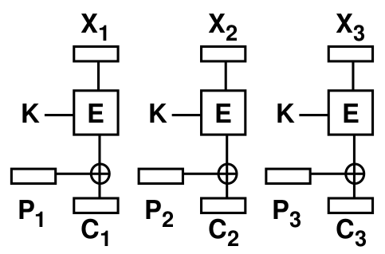
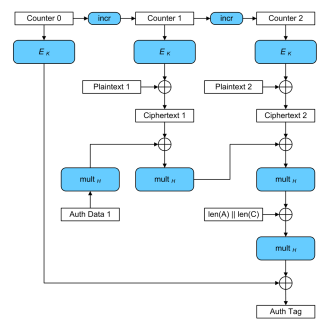
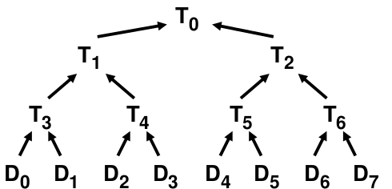

# Netsec
## Crypto Refresher
### Language
| Term | Explanation |
| --- | --- |
| Secrecy |keep data hidden from unintended users
|Confidentiality|keep somebody else's data secret
|Privacy|keep data about a person secret, i.e. the link between data and person
|Anonymity|keep identity of protocol participant secret
|Integrity|data is unchanged
|Authentication |make sure data comes from the claimed sender
|Signature |Authentication, plus the receiver can proof authentication also to third party

### Symmetric Cryptographic Primitives 
#### Stream Ciphers
- Encrypt whole message with key with the same length as message
- An example is ChaCha stream Cipher
- :x: Key must not be reused
- :x:  Alteration of ciphertext will alter corresponding values in plaintext after decryption
#### Block Ciphers
Message is split into blocks, each block is encrypted separately.
As encryption algorithm for example AES can be used.

Block ciphers describe the way of how the message and the key is feed into the
encryption algorithm, but do not describe the encryption algorithm itself.
##### Electronic Code Book (ECB)

- Split message in blocks, encrypt each block separately, but with same key
- :heavy_check_mark: fast
- :x: Same plaintext always corresponds to same ciphertext
- :x: Adversary may can guess part of plaintext, can decrypt parts of a message if same
ciphertext block occurs
- :x: Adversary can replace blocks with other blocks
##### Cipher Block Chaining (CBC)

- :heavy_check_mark: Semantic security (best guess for single plaintext bit is random)
- :x: Altered ciphertext only influences two blocks
- :x: Not secure for variable-sized messages!

##### Counter Mode (CTR)

- :heavy_check_mark: Semantic security
- :x: Altered ciphertext only influences single block
- :x: same vulnerabilities as stream cipher

#### Message Authentication Codes
A code attached to a message, to prove that the message was not altered ont the way to the receiver.
Can be implemented with a **hash**, **cipher** or other

#### Authenticated Encryption with Associated Data (AEAD)
A cryptographic primitive that combines **encryption** and **mac**

##### Galois Counter Mode (GCM)

a possible implementation of a AEAD

### Asymmetric Cryptographic Primitives 
#### Diffie–Hellman
- public values: generator `g` and large prime `p`
- secret values: Alice `a`, Bob `b`
- A -> B: $g^a (\mod p)$
- B -> A: $g^b (\mod p)$
- $g^{ab} (\mod p)$ can now be used as key
- To solve this for `a` or `b` Eve would have to solve the discrete logarithm problem
- power calculations are easy because they are only calculated in modulo
- vulnerable to man in the middle attack, if Eve acts as Bob to Alice, and as Alice to Bob

[Explanation](http://pi.math.cornell.edu/~mec/2003-2004/cryptography/diffiehellman/diffiehellman.html)

#### RSA
**Key creation**
- `p`, `q` are large secret primes
- pick `e`, compute `d` such that $ed \equiv 1 \mod \phi(pq)$ where $\phi(x,y) = (x-1)*(y-1)$
- Public key: `pq`, `e`
- Private key: `p`, `q`, `d`

**Encryption**
- Signature $\Sigma = M^d \mod pq$ 

**Decryption**
- $M = \Sigma^e \mod pq = M^{de} \mod pq = M^{1+\phi(pq)} \mod pq= M \mod pq$

#### Encrypted Key Exchange (EKE)
gitter, gatter, gotter who tis? :flushed:

### Hash Functions
#### One-Wayness
One-wayness: given output `y` (width of `n` bits), how many operations does it take to find any `x`,
such that $H(x) = y$?
- Assumption: best attack is random search
- For each trial `x`, probability that output is `y` is $2^{-n}$
- $P[\text{find x after m trials}]=1-(1-2^{-n})^{m}$
- Rule of thumb: find x after $2^{n-1}$ trials on average

#### Weak Collision Resistence
Given input x, how
many operations does it take to find another $x’ ≠ x$, s.t. $H(x) = H(x’)$?
- Assumption: best attack is random search
- For each trial `x`, probability that output is `y` is $2^{-n}$
- $P[\text{find x after m trials}]=1-(1-2^{-n})^{m}$
- Rule of thumb: find x after $2^{n-1}$ trials on average

#### Strong Collision Resistence
How many operations does it take to find a `x` and `x'` s.t. $x’ ≠ x$ and $H(x) = H(x’)$?
- Assumption: best attack is random search
- Algorithm picks random `x’`, checks whether `H(x’)` matches any other output value previously seen
- $P[\text{find col after m trials}]= 1-(1-1/2^n )(1-2/2^n )(1-3/2^n )...(1-(m+1)/2^n )$
- Rule of thumb: find x after $2^{n/2}$ trials on average

### One-Way Hash Chains
Chain hash functions together. Improves One-Wayness (glaub :flushed:)

### Merkle Hash Trees

Use leafs to calculate parent. Verify leaf easily

<!--stackedit_data:
eyJoaXN0b3J5IjpbLTkyNTE2MTM5OSwtMTA0Nzk4MDc4Myw4MD
IwNDExMjAsLTEyNzk2MTE4NDFdfQ==
-->