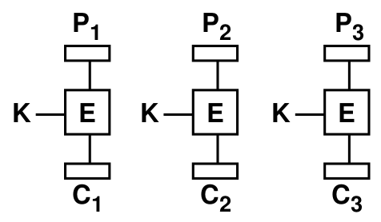
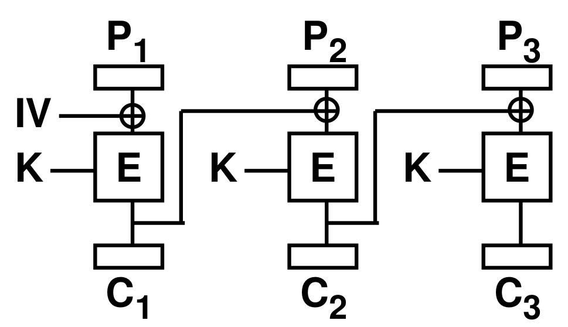

# Netsec
## Crypto Refresher
### Language
| Term | Explanation |
| --- | --- |
| Secrecy |keep data hidden from unintended users
|Confidentiality|keep somebody else's data secret
|Privacy|keep data about a person secret, i.e. the link between data and person
|Anonymity|keep identity of protocol participant secret
|Integrity|data is unchanged
|Authentication |make sure data comes from the claimed sender

### Cryptographic Primitives 
#### Stream Ciphers
- Encrypt whole message with key with the same length as message
- An example is ChaCha stream Cipher
- :x: Key must not be reused
- :x:  Alteration of ciphertext will alter corresponding values in plaintext after decryption
#### Block Ciphers
Message is split into blocks, each block is encrypted separately 
##### Electronic Code Book (ECB)

- Split message in blocks, encrypt each block separately, but with same key
- :heavy_check_mark: fast
- :x: Same plaintext always corresponds to same ciphertext
- :x: Adversary may can guess part of plaintext, can decrypt parts of a message if same
ciphertext block occurs
- :x: Adversary can replace blocks with other blocks
##### Cipher Block Chaining (CBC)

- 
