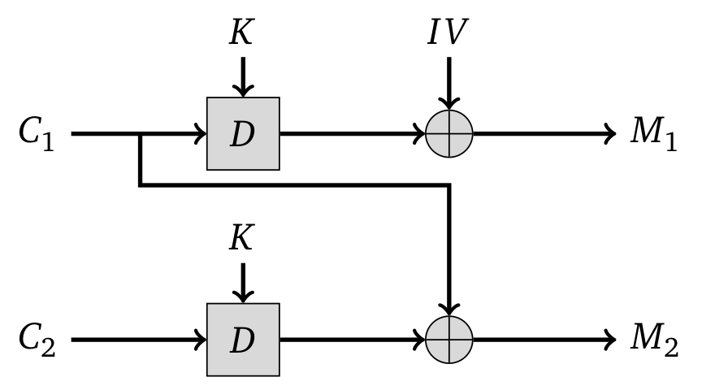
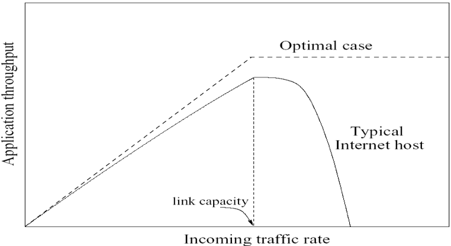
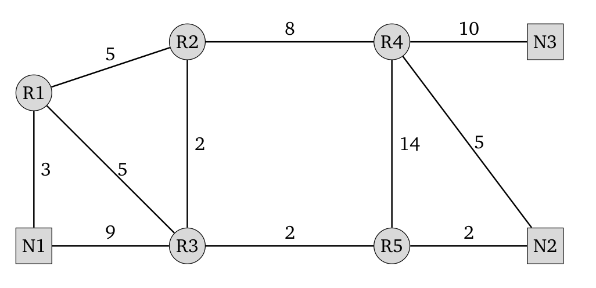

# Exercise sheet 1: Crypto and Networks refresher

## Crypto refresher

### Question 1 
Concisely answer the following questions:

**1.1.** (2 points)
Edward wants to prove to Laura he really is the sender of a message. What security property is he trying to achieve?  Which cryptographic primitive could he use?

*Solution*: Authentication - they could use digital signatures or HMACs.

**1.2.** (2 points)
Edward wants to send a secret message to Glenn---they cannot meet to exchange a key, but they deem it unlikely for the NSA to tamper with their messages on the fly~\footnote{Not historically accurate}. What security property are Edward and Glenn trying to achieve? Which cryptographic primitives could they use?

*Solution*: Secrecy - they could use asymmetric encryption.

**1.3.** (2 points)
Edward wants to store records of his job assignments at NSA on his NAS. Which property ensures that nobody will alter the record before it reaches the NAS? Can you name a network protocol which provides this guarantee? (assume a fair use of the protocol)

*Solution*: Integrity. TLS (level 4) / IPsec (level 3).

**1.4.** (2 points)
Chelsea wants to share some documents with a journalist, without risking to be identified.  What security property is she trying to achieve?  Can you name a technology that could, in principle, protect her?

*Solution*: Anonymity. The TOR network could help Chelsea, but she needs to be careful---correlation and other statistical attacks could expose her even if she is using an up-to-date TOR client.

### Question 2 (2 points)
Given a Merkle Hash Tree with n leaves, how many nodes need to be recomputed if a leaf is updated? (Assume a binary balanced fully populated tree).

*Solution*: `log(n)`

### Question 3 (4 points)
You are using AES in ECB mode to encrypt an uncompressed high-resolution image. What could go wrong?

*Solution*: 


[More details here](https://blog.filippo.io/the-ecb-penguin/)

ECB mode will encrypt the same plaintext block to the same ciphertext. AES block size is 128 bits, which is just 16 bytes. Some features of the plaintext will still be visible in the ciphertext---in the case of an image, edges and large uniformly colored areas will be particularly noticeable.

### Question 4 
You are writing a network protocol to control your server remotely---you decide to simply use AES in CBC mode to encrypt communication.

**4.1.** (3 points)
What could go wrong?

*Solution*: The protocol is susceptible of:
(a) Replay attacks - an attacker can intercept an encrypted command and feed it back to the server;
(b) Command manipulation - an attacker can modify the plaintext by manipulating parts the ciphertext.

Remember CBC mode decryption:



An attacker could modify how a ciphertext block is decrypted by making changes to its previous block.

For example, let's assume that the plaintext command only contains one block, padded following the PKCS7 standard. That block and the IV are sent to the server. The attacker could intercept the command, modify the IV XORing it with bytes of his choice, and consequently modify the command. If the attacker could guess the command was `ls -al /`}, XORing the IV with 
```
\x1e\x1e\x00\x00\x13\n\x00\x00
``` 
would make the command decrypt to `rm -rf /`.

**4.2 Bonus question.** (3 points)
You learn from your past mistakes and decide to appropriately MAC all commands before encrypting them. Commands are padded to exactly fit in a block using standard PKCS7 padding. The server will report and error if the MAC verification fails, and a different error if padding verification fails. What could still go wrong?

*Solution*: The attacker could mount a _padding oracle attack_ (https://en.wikipedia.org/wiki/Padding_oracle_attack) against the server. In short: the attacker can distinguish between an invalid padding error (no reply) and the MAC error, and can use this to brute-force the plaintext byte by byte.

For example, let's again assume that there is a single ciphertext block. The attacker can brute-force the last byte of the plaintext in a block $`pt_{15}`$, manipulating the last byte of the IV, $`iv'_{15} = iv_{15} \oplus n_{15}`$, until she obtains a valid padding. Since

```math
pt_{15} = dec(ct_{15}) \oplus iv_{15}

pt'_{15} = dec(ct_{15}) \oplus (iv_{15} \oplus n_{15})
```

the PKCS7 padding will be valid for $`n_{15} = 0, pt'_{15} = pt_{15}`$ and for $`n_{15} \ne 0, pt'_{15} = PKCS7(1) = \mathtt{0x01}`$. It follows from the latter that that:

```math
pt_{15} = dec(ct_{15}) \oplus iv_{15} = pt'_{15} \oplus n_{15} = PKCS(1) \oplus n_{15} = \mathtt{0x01} \oplus n_{15}
```

At most 255 (0x00 is valid as the original message is assumed to be valid) tries are necessary to brute-force the last byte $n_{15}$.
We learn the last plaintext byte and thus directly all the other padding bytes (again assuming a valid original message).
Each of the other bytes can be found after at most 256 tries.

## Network refresher

### Question 5 
Concisely answer the following questions:

**5.1.** (2 points)
Explain what bandwidth allocation is, and what requirements we pose on a bandwidth allocation algorithm.

*Solution*: Bandwidth allocation is the way the bandwidth available on a link is split among different traffic flows. We want it to be efficient (use as much bw as possible) and fair (no one gets too much bw), while avoiding congestions.
One example of bandwidth allocation is congstion control.

**5.2.** (1 points)
How does UDP deal with bandwidth allocation?

*Solution*: The UDP protool has no congestion control scheme.

**5.3.** (1 points)
How does TCP deal with bandwidth allocation?

*Solution*: Slow start and Additive Increase Multiplicative Decrease.

**5.4.** (2 points)
The simpler nature of UDP is not necessarily a disadvantage. When is UDP preferred over TCP?

*Solution*: When most of the features of TCP are not required, like media streaming services. In these cases, the loss of a limited number of packets is often acceptable.

**5.5.** (3 points)
TCP is more complex than UDP. This complexity results in overheads, both in time and storage space. Let's focus on storage: the server has to store the state of each connection in its memory. Do you see a potential problem with this?

*Solution*: An attacker can open a high number of TCP connections and keep them open, filling the server memory and preventing it from accepting legitimate connections. This attack is called SYN flood and will be covered later in the course.

### Question 6 (3 points)
Explain why is congestion detrimental to networks.

*Solution*: 


Network links work a bit like roads. If there are many cars on a road, traffic doesn't just flow smoothly at maximum capacity. Any minimal disruption causes endless lines of vehicles, and the road could stop being usable. In a congested network routers often can't cope, and the usable bandwidth on some links could even drop to zero. This results in dropped packets. Packet losses, in turn, cause retransmissions in TCP, which make the situation even worse. This situation is called congestion collapse.

### Question 7 
Routing algorithms are at the heart of routers. Open Shortest Path First (OSPF), is a link-state protocol used in many real world scenarios. In OSPF, every link has a specific cost and the goal is to find the best possible route. Here is a simple explanation of how it works:
<https://www.auvik.com/franklymsp/blog/ospf-protocol-explained/>.

**7.1.** (5 points)
Consider the following network. The square nodes are local-area networks (LANs), while the round nodes are routers. LANs can only receive and generate packets, they can't route incoming traffic. Fill in the routing tables below.



R1:

| target | next hop |
| :----: | :------: |
|   N1   |   ...    |
|   N2   |   ...    |
|   N3   |   ...    |

R2:

| target | next hop |
| :----: | :------: |
|   N1   |   ...    |
|   N2   |   ...    |
|   N3   |   ...    |

R3:

| target | next hop |
| :----: | :------: |
|   N1   |   ...    |
|   N2   |   ...    |
|   N3   |   ...    |

  
  
R4:

| target | next hop |
| :----: | :------: |
|   N1   |   ...    |
|   N2   |   ...    |
|   N3   |   ...    |

R5:

| target | next hop |
| :----: | :------: |
|   N1   |   ...    |
|   N2   |   ...    |
|   N3   |   ...    |

  
  
N1:

| target | next hop |
| :----: | :------: |
|   N2   |   ...    |
|   N3   |   ...    |

N2:

| target | next hop |
| :----: | :------: |
|   N1   |   ...    |
|   N3   |   ...    |


**Solution:**


R1:

| target | next hop |
| :----: | :------: |
|   N1   |    N1    |
|   N2   |    R3    |
|   N3   |    R2    |

R2:

| target | next hop |
| :----: | :------: |
|   N1   |    R1    |
|   N2   |    R3    |
|   N3   |    R4    |

R3:

| target | next hop |
| :----: | :------: |
|   N1   |    R1    |
|   N2   |    R5    |
|   N3   |    R2    |

  
  
R4:

| target | next hop |
| :----: | :------: |
|   N1   |    R2    |
|   N2   |    N2    |
|   N3   |    N3    |

R5:

| target | next hop |
| :----: | :------: |
|   N1   |    R3    |
|   N2   |    N2    |
|   N3   |    R3    |

  
N1:

| target | next hop |
| :----: | :------: |
|   N2   |    R1    |
|   N3   |    R1    |

N2:

| target | next hop |
| :----: | :------: |
|   N1   |    R5    |
|   N3   |    R4    |

**7.2.** (3 points)
You want to isolate the flows N1 $`\rightarrow`$ N3 and N1 $`\rightarrow`$ N2. Does this configuration satisfy this property? If not, how would you change the costs so that it does?

*Solution*: Path 1: N1 $`\rightarrow`$ R1 $`\rightarrow`$ R3 $`\rightarrow`$ R5 $`\rightarrow`$ N2.

Path 2: N1 $`\rightarrow`$ R1 $`\rightarrow`$ R2 $`\rightarrow`$ R4 $`\rightarrow`$ N3.

The property is not respected as the first link is shared. The cost between N1 and R3 must be lower than 8, so that N1 will route any packet with target N2 through R3 instead.

**7.3.** (2 points)
An external authority forces you to add a static route (with maximum priority) that sends any packet that reaches R5 to the link R5 $`\rightarrow`$ R4. Ignoring the longer routes and the unused links, what problems can arise?

*Solution*:  The danger of congestion increases significantly. traffic from N1 to N2 will now go through R4, as well as traffic from N2 to N1. Basically, all traffic goes through R4, which probably needs to be upgraded in order to avoid problems.

