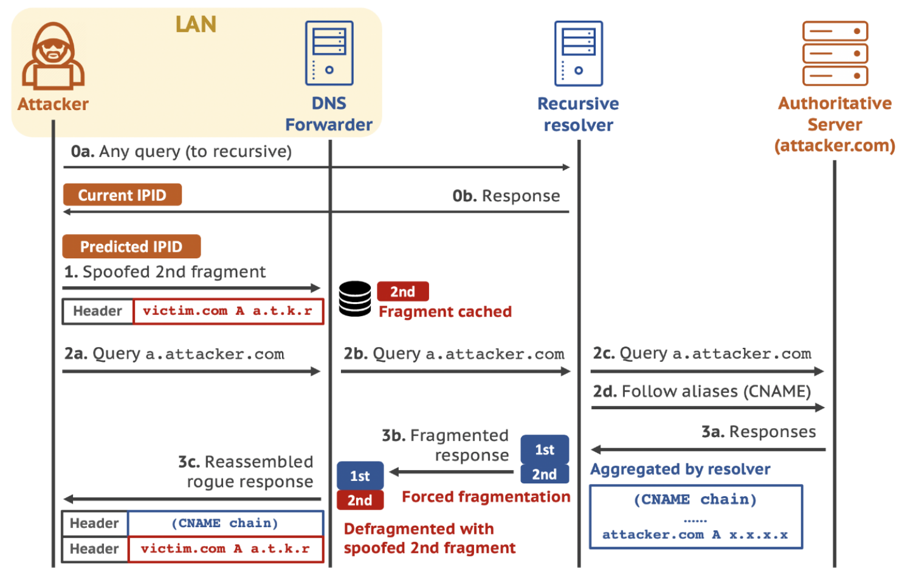

# Exercise sheet 11: DNS Security

*24 November 2020*

Handing in this exercise sheet is optional.
If you want individual feedback for your solutions, you have to hand in your solution by the **Wednesday following exercise publication, December 2, at 23:59**.
The hand-in procedure is as follows:

- copy this document, and answer the questions in the appropriate spaces;
- create a new issue on [the GitLab issue repo](https://gitlab.inf.ethz.ch/PRV-PERRIG/netsec-course/netsec-2020-issues);
- the issue title must be in the form `[exercise-hand-in] Exercise 11 {YOUR NETHZ ID}` (without curly braces); 
- you should set the issue as confidential;
- paste the modified document with your solution in the body of the issue. 

### Question 1 
The `dig` tool can be used to perform DNS queries on Linux and MacOS
systems. In this question, we will perform a recursive lookup for the
domain `netsec.ethz.ch` using `dig`. Type the command
`dig +trace netsec.ethz.ch` to run a recursive search. Then, use the
output of the command to answer the following questions.

**1.1.** (1 points)
What is the difference between a stub and a recursive resolver?

*Solution:* Your solution here

**1.2.** (1 points)
DNS names are composed of labels separated by dots, and a server may
return a match for part of a query if it does not have the answer for
the whole domain name. Which servers have replied to your requests (IPs
and domain names)? What part of the domain did you request them?

*Solution:* Your solution here

**1.3.** (2 points)
What role do the NS records have in the resolution?

*Solution:* Your solution here

**1.4.** (2 points)
What is the Time To Live (TTL) value of the CNAME record of
`netsec.ethz.ch.`? Name one advantage and one disadvantage of a short
TTL?

*Solution:* Your solution here

**1.5.** (2 points)
What is a CNAME record used for? Can you give an example of when it is
used in the real world?

*Solution:* Your solution here

### Question 2 
A recent publication, “Poison Over Troubled Forwarders: A Cache
Poisoning Attack Targeting DNS Forwarding Devices”[1], describes a DNS
cache poisoning attack against DNS forwarders. Answer the following
questions.

[1] <https://www.usenix.org/system/files/sec20-zheng.pdf>

<figure>

</figure>

**2.1.** (2 points)
You own the authoritative server for the domain `attacker.com`, and you
would like to trick a recursive resolver into accepting a record for
`victim.com`. Why is it **not** possible?

*Solution:* Your solution here

**2.2.** (2 points)
The paper describes two classes of attacks against DNS recursive
resolvers: forging and defragmentation attacks. Why are those attack
still present in spite of in-bailiwick checks? Are they likely to
succeed?

*Solution:* Your solution here

**2.3.** (1 points)
What is a DNS forwarder? How does a forwarder relate to other pieces of
DNS infrastructure, such as recursive resolvers?

*Solution:* Your solution here

**2.4.** (2 points)
In the defragmentation attack against DNS forwarders described in the
paper, how does an attacker cause IP fragmentation without reducing the
Path Maximum Transmission Unit (PMTU)? Why does the attacker need to
control both a client of the target forwarder and an authoritative
server?

*Solution:* Your solution here

**2.5.** (2 points)
What are some countermeasures that a vulnerable DNS forwarder should
implement?

*Solution:* Your solution here

**2.6.** (2 points)
Why does this attack work on DNS forwarders and not on recursive
resolvers?

*Solution:* Your solution here

**2.7.** (2 points)
Let’s assume the attack succeeds, and an attacker in your LAN manages to
inject a poisoned cached A record for `google.com`. If you now try to
visit `google.com` with a web browser, what will happen?

*Solution:* Your solution here

### Question 3 
On 24th April 2018, the Ethereum wallet webapp MyEtherWallet found out
that a great base of their users was being redirected to a phishing
website[1]. The attackers were able to loot $150k worth of ETH[2] before
the legitimate DNS records were restored.

[1] <https://techcrunch.com/2018/04/24/myetherwallet-hit-by-dns-attack/>

[2] the cryptocurrency, not Eidgenössische Technische Hochschule

**3.1.** (1 points)
What kind of DNS attack is this?

*Solution:* Your solution here

**3.2.** (3 points)
How does this kind of DNS attack work? What section of the DNS reply is
abused?

*Solution:* Your solution here

**3.3.** (2 points)
Why are these attacks particularly challenging to mitigate?

*Solution:* Your solution here

**3.4.** (2 points)
The unfortunate users that had their money stolen missed a very
important hint in their browsing sessions. Which one? Why is this
alarming?

*Solution:* Your solution here

### Question 4 
Due to privacy (<https://dnsdiag.org/>), security (see previous
exercise) concerns, DNS over HTTPS (**DoH**) is starting to see
widespread deployment. Some privacy enthusiasts welcomed this
development as positive[1], while many ISP and governments already
oppose it[2][3]. The last issue of the Internet Protocol Journal[4], and
many academic publications[5][6], on the other hand, have a more
skeptical position.

[1] <https://hacks.mozilla.org/2018/05/a-cartoon-intro-to-dns-over-https/>

[2] <https://www.theregister.co.uk/2019/07/06/mozilla_ukisp_vallain/>

[3] <https://arstechnica.com/tech-policy/2019/09/isps-worry-a-new-chrome-feature-will-stop-them-from-spying-on-you/>

[4] <http://ipj.dreamhosters.com/wp-content/uploads/2019/07/ipj222.pdf>,
you should really read this

[5] <https://arxiv.org/pdf/1906.09682.pdf>

[6] <https://dl.acm.org/citation.cfm?id=2665959>, you can use ETH’s ACM
subscription

**4.1.** (2 points)
DoH may effectively prevent your ISP form analyzing your DNS traffic –
but who is the implicit trusted party in DoH? Try to answer this
question for Firefox’s and Chrome’s DoH deployments (or deployment
plans).

*Solution:* Your solution here

**4.2.** (2 points)
What are the economic incentives for running an DoH open DNS resolver?
What do Cloudflare’s 1.1.1.1 policies state on that purpose?

*Solution:* Your solution here

**4.3.** (3 points)
What is the general effect of DoH with regards to the decentralization
of the Internet? Consider the case of Google and Cloudflare – what would
each of those companies control?

*Solution:* Your solution here

**4.4.** (2 points)
Centralization poses both a political and technical problem: only
considering the latter, what is the effect of DoH on DNS caches? Why is
this not a problem for DoH performance?

*Solution:* Your solution here
