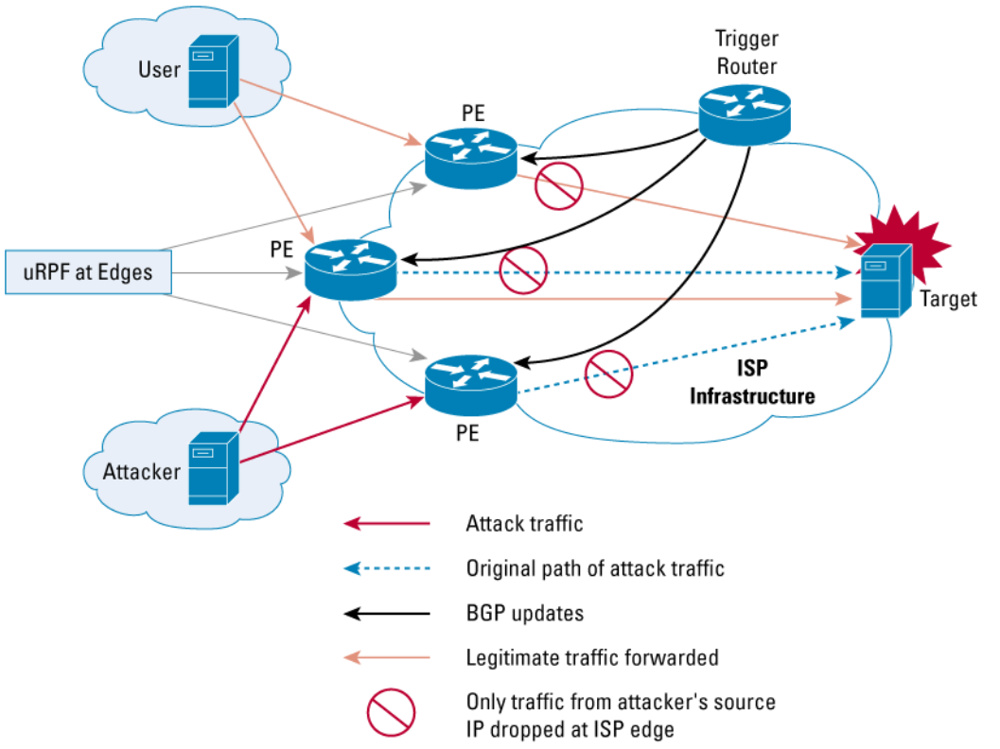
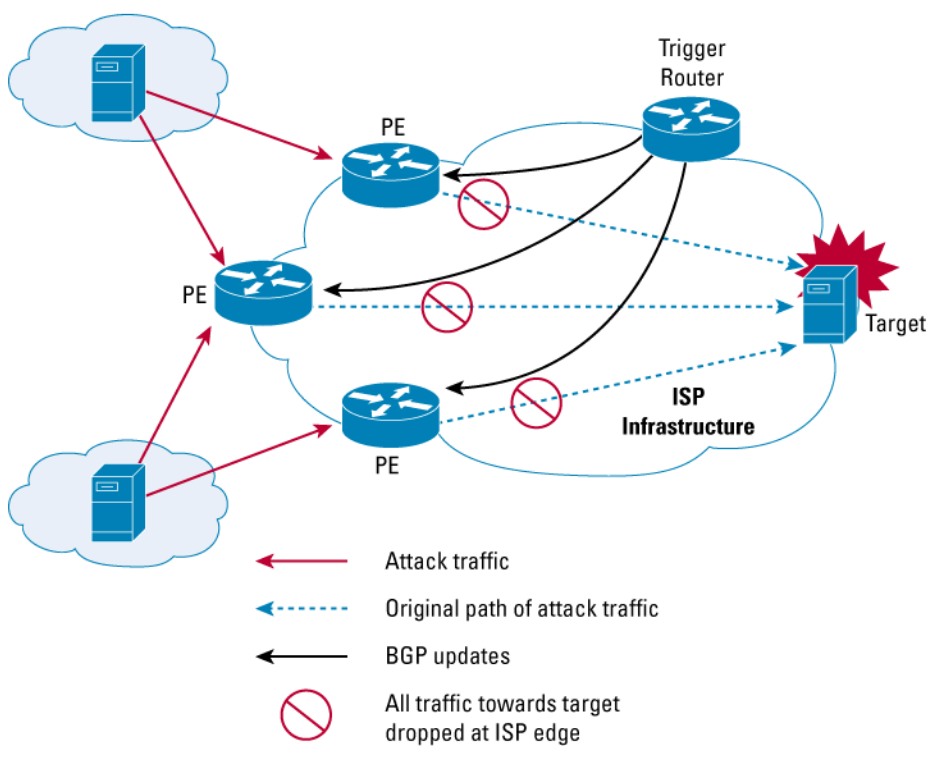

# Exercise sheet 12: Denial of Service

*02 December 2020*

Handing in this exercise sheet is optional.
If you want individual feedback for your solutions, you have to hand in your solution by the **Wednesday following exercise publication, December 9, at 23:59**.
The hand-in procedure is as follows:

- copy this document, and answer the questions in the appropriate spaces;
- create a new issue on [the GitLab issue repo](https://gitlab.inf.ethz.ch/PRV-PERRIG/netsec-course/netsec-2020-issues);
- the issue title must be in the form `[exercise-hand-in] Exercise 12 {YOUR NETHZ ID}` (without curly braces); 
- you should set the issue as confidential;
- paste the modified document with your solution in the body of the issue. 

### Question 1 
Remotely Triggered Black Hole Filtering (**RTBH** in short) is a generic
technique that can be used to mitigate volumetric DoS attacks – the
offending traffic is simply dropped (black-holed) at the border routers
of an autonomous system (AS). RTBH comes in two flavours, source-based
and target-based.\[1\]

1.  <https://www.cisco.com/c/dam/en/us/products/collateral/security/ios-network-foundation-protection-nfp/prod_white_paper0900aecd80313fac.pdf>

**1.1.** (4 points)
In source-based RTBH, all the traffic from the attacker’s subnets is
dropped by the target’s ISP.

- \[2\] How is the network of the ISP affected? What about the target of the
DoS?

**Solution**:
In this case, both the network and the target are protected from the
DoS. The ISP absorbs all of the attack at its border routers. If the
attack is particularly large, there could be problems at the upstream
provider of our ISP.

- \[2\] Why is this technique hard to implement, in the case of a DDoS attack?
Can you imagine which unintended consequences it may have?

**Solution**:
During a DDoS attack, it is really difficult for the defending ISP to
differentiate malicious traffic from benign traffic, especially when the
ISP is facing a botnet. This often leads to attack traffic still
reaching the victim (false negatives). Moreover, many benign flows
coming from the same subnets where infected machines reside are often
dropped as collateral damage (false positives). If an amplification
attack was used, legitimate traffic from the abused services would be
dropped as well.

**1.2.** (11 points)
In destination-based RTBH, all the traffic to the target’s subnets is
dropped by the target’s ISP.

-  \[2\] Why is this a viable strategy? What is the goal of an ISP in this
case?

**Solution**:
For any small ISP, having a host under DDoS attack is certainly a
problem, since most of the ISP’s infrastructure will be under stress.
The best course of action for an ISP is to drop traffic (as the name
suggests, blackhole) destined to the host under attack as soon as
possible, so that other customers are not damaged and its network does
not collapse.

-  \[2\] How does this strategy affect the attacked host’s problems? Would
you say this solution solved the DDoS problem?

**Solution**:
It doesn’t solve any problem for the target host. That machine will be
effectively incapable of receiving any traffic, because the ISP is
dropping it. As a result, the attacker will have practically succeeded
in its intent to DoS.

On the other hand, if the target host has itself a network to protect,
it gains the same benefits as the ISP by sacrificing just one device
under attack.

-  \[3\] Let us now delve into the technical details of this solution.  
In our setup, which network components should do the blackholing? Why?
What kind of configuration allows them to drop traffic?

**Solution**:
The ideal place to drop the traffic is indeed the border routers, so
that the traffic does not even enter the AS.

The traffic is 'sinked' by adding a null route in the forwarding table
(also known as FIB, forwarding information base):
they receive an iBGP update which sets the 'next hop' for the target
IP to the IP address of a blackhole interface.

In particular, let's assume `192.0.2.1` is the IP of the `null0`
blackhole interface (the subnet `192.0.2.0/24` is reserved for testing
purposes), and the target of the DDoS attack is `1.1.1.1`.
The border router would receive an iBGP update telling it to use
`192.0.2.1` as a next hop for `1.1.1.1`, and therefore it would discard
the traffict by sending it to the `null0` interface.

-  \[3\] The other component involved is the trigger, which can be any
device with iBGP connectivity inside the AS. What role does it have in
the system? In addition, explain how the trigger interacts with the
border routers.

**Solution**:
The trigger is manually configured by the network admin, in order to
establish which destination IPs must be banned.

The admin, more specifically, will insert route updates that route
traffic destined to the attacked IP to the placeholder IP, `192.0.2.1`.
These routes will then be propagated via iBGP to the edge routers,
effectively making them send all the attack traffic to `null0`. Here is
an example update:  
`Target: 129.132.19.216`  
`Next hop: 192.0.2.1`  
`Community: "no export"`  

Once the updates are received by the border routers, they will know to
send all traffic destined to `129.132.19.216` to `192.0.2.1` instead.
But their static route will tell them that `192.0.2.1` must be sent to
the interface `null0`, which sinks the traffic.

-  \[1\] Normally, whenever a packet is dropped, an ICMP message would be
sent back to inform the sender. Is this behaviour desirable here? Why?

**Solution**:
No, it is not desirable. The ICMP messages would just increase the
volume of traffic on the attack path. Moreover, we do not want the
attacker to know which DoS countermeasures are in place.

### Question 2
(D)DoS attacks work by exhausting critical resources. For each attack:
1. identify the targeted critical resource;
2. discuss how the attack prevents the normal operation;
3. propose a mitigation.

**2.1.** (3 points)
Slowloris attack\[1\]

1. <https://www.incapsula.com/ddos/attack-glossary/slowloris.html>

**Solution**:
Every web server has a limit on the number of HTTP connections that can
be open at the same time. Slowloris monopolizes them, preventing the
server from accepting any new ones. This can be partially fixed by
limiting the number of connections from the same IP, increasing the
maximum number of connections, or detecting the attack and killing a
connection (eg. slow transfer speeds).

**2.2.** (3 points)
Issuing thousands of OSCP requests to a buggy OpenSSL implementation
that does not free the memory allocated to process the requests\[1\].

1. https://www.openssl.org/news/secadv/20160922.txt>

**Solution**:
The critical resource here is RAM. After enough requests, the process
will crash due to memory exhaustion. The solution is simple - update
SSL.

**2.3.** (3 points)
Flooding the embedded devices that uses public key cryptography for
message authentication with random messages.

**Solution**:
Asymmetric cryptography is slow and consumes a lot of power. This attack
can either take all of CPU time on the device, preventing it from
processing legitimate requests, or drain the battery, forcing it to shut
down. If possible, the device should rely on symmetric cryptography. You
could also use rate limiting to reduce the number of requests coming
from the same source, but that doesn’t solve the problem completely.
Another approach is to limit the number of messages for which the costly
operations have to be performed. This could for example mean filtering
incoming messages based on estimated message origin or message
structure.

**2.4.** (3 points)
Sending packets crafted specifically to trigger the worst-case scenario in
a hash-map.

**Solution**:
The worst-case scenario in a hash-map is mapping all N objects to a
single index. Searching this hash-map takes O(N) times, instead of
expected O(1). This takes a lot of CPU time, prolonging the time needed
to serve a request, and causing the to pile up in the queue. The
solution would be to use a data-structure that is resistent to an attack
like this, while still providing sublinear search times (eg. trees).

**2.5.** (3 points)
TCP SYN flood attack\[1\]: sending many TCP SYN requests to the victim
server.

1. <https://www.incapsula.com/ddos/attack-glossary/syn-flood.html>

**Solution**:
Every time a TCP handshake is initiated, the receiving machine needs to
store the data about it in kernel memory. In order to prevent memory
exhaustion, the number of half-open TCP ports is limited. TCP SYN flood
tries to keep as many TCP ports as possible in the half-open state, thus
forcing the server to reject new connections. This is done by sending as
many TCP SYN packets as possible (hence the name SYN FLOOD). We can
protect against the SYN flood by not keeping the state on our machine,
until the other side proves that they are reachable. This can be
accomplished by SYN Cookies \[1\]  which encode the data on the connection.

1. <https://cr.yp.to/syncookies.html>

**2.6.** (3 points)
Reflection DDoS attack, e.g. a 1.3 Tbps DDoS attack on Github caused by
spoofed queries to public memcached servers.\[1\]

1. <https://www.wired.com/story/github-ddos-memcached/>

**Solution**:
Volume-based DoS attacks try to saturate the network infrastructure,
preventing any legitimate users from using the service. Here the
solution was to divert the traffic to multiple different paths and
filter the malicious traffic. The remaining traffic was forwarded to
Github servers.
