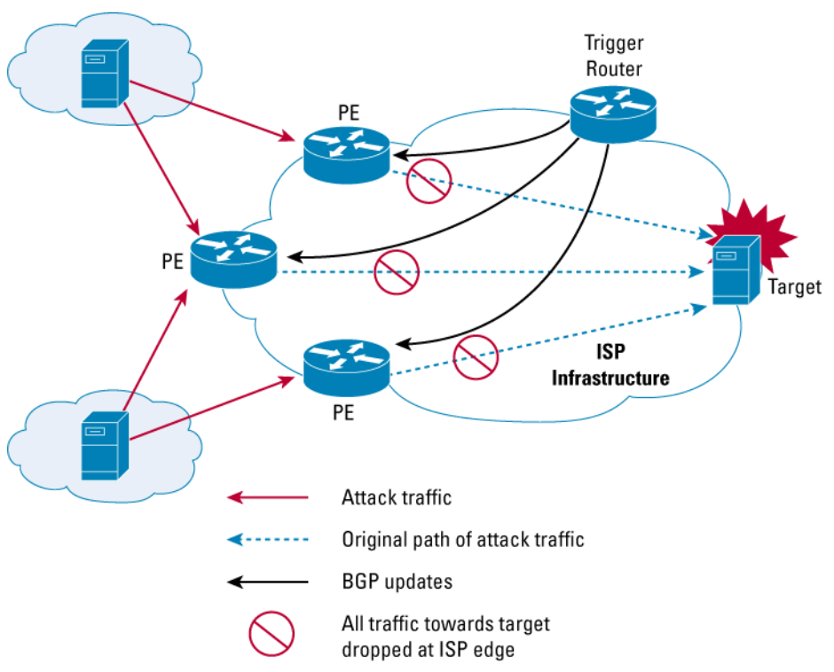

# Exercise sheet 12: Denial of Service

*02 December 2020*

Handing in this exercise sheet is optional.
If you want individual feedback for your solutions, you have to hand in your solution by the **Wednesday following exercise publication, December 9, at 23:59**.
The hand-in procedure is as follows:

- copy this document, and answer the questions in the appropriate spaces;
- create a new issue on [the GitLab issue repo](https://gitlab.inf.ethz.ch/PRV-PERRIG/netsec-course/netsec-2020-issues);
- the issue title must be in the form `[exercise-hand-in] Exercise 12 {YOUR NETHZ ID}` (without curly braces); 
- you should set the issue as confidential;
- paste the modified document with your solution in the body of the issue. 

### Question 1 
Remotely Triggered Black Hole Filtering (**RTBH** in short) is a generic
technique that can be used to mitigate volumetric DoS attacks – the
offending traffic is simply dropped (black-holed) at the border routers
of an autonomous system (AS). RTBH comes in two flavours, source-based
and target-based.\[1\]

1.  <https://www.cisco.com/c/dam/en/us/products/collateral/security/ios-network-foundation-protection-nfp/prod_white_paper0900aecd80313fac.pdf>

**1.1.** (4 points)
In source-based RTBH, all the traffic from the attacker’s subnets is
dropped by the target’s ISP.

- \[2\] How is the network of the ISP affected? What about the target of the
DoS?

*Solution:* Your solution here

- \[2\] Why is this technique hard to implement, in the case of a DDoS attack?
Can you imagine which unintended consequences it may have?

*Solution:* Your solution here

**1.2.** (11 points)
In destination-based RTBH, all the traffic to the target’s subnets is
dropped by the target’s ISP.

-  \[2\] Why is this a viable strategy? What is the goal of an ISP in this
case?

*Solution:* Your solution here

-  \[2\] How does this strategy affect the attacked host’s problems? Would
you say this solution solved the DDoS problem?

*Solution:* Your solution here

-  \[3\] Let us now delve into the technical details of this solution.  
In our setup, which network components should do the blackholing? Why?
What kind of configuration allows them to drop traffic?

*Solution:* Your solution here

-  \[3\] The other component involved is the trigger, which can be any
device with iBGP connectivity inside the AS. What role does it have in
the system? In addition, explain how the trigger interacts with the
border routers.

*Solution:* Your solution here

-  \[1\] Normally, whenever a packet is dropped, an ICMP message would be
sent back to inform the sender. Is this behaviour desirable here? Why?

*Solution:* Your solution here

### Question 2
(D)DoS attacks work by exhausting critical resources. For each attack:
1. identify the targeted critical resource;
2. discuss how the attack prevents the normal operation;
3. propose a mitigation.

**2.1.** (3 points)
Slowloris attack\[1\]

1. <https://www.incapsula.com/ddos/attack-glossary/slowloris.html>

*Solution:* Your solution here

**2.2.** (3 points)
Issuing thousands of OSCP requests to a buggy OpenSSL implementation
that does not free the memory allocated to process the requests\[1\].

1. https://www.openssl.org/news/secadv/20160922.txt>

*Solution:* Your solution here

**2.3.** (3 points)
Flooding the embedded devices that uses public key cryptography for
message authentication with random messages.

*Solution:* Your solution here

**2.4.** (3 points)
Sending packets crafted specifically to trigger the worst-case scenario in
a hash-map.

*Solution:* Your solution here

**2.5.** (3 points)
TCP SYN flood attack\[1\]: sending many TCP SYN requests to the victim
server.

1. <https://www.incapsula.com/ddos/attack-glossary/syn-flood.html>

*Solution:* Your solution here

**2.6.** (3 points)
Reflection DDoS attack, e.g. a 1.3 Tbps DDoS attack on Github caused by
spoofed queries to public memcached servers.\[1\]

1. <https://www.wired.com/story/github-ddos-memcached/>

*Solution:* Your solution here
