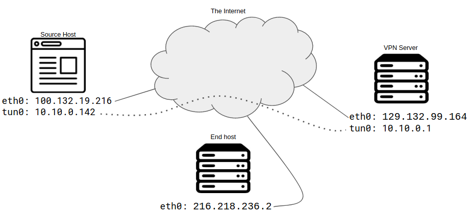

# Exercise sheet 5: Virtual Private Networks

*14 October 2020*

Handing in this exercise sheet is optional.
If you want individual feedback for your solutions, you have to hand in your solution by the **Wednesday following exercise publication, October 21, at 23:59**.
The hand-in procedure is as follows:

- copy this document, and answer the questions in the appropriate spaces;
- create a new issue on [the GitLab issue repo](https://gitlab.inf.ethz.ch/PRV-PERRIG/netsec-course/netsec-2020-issues);
- the issue title must be in the form `[exercise-hand-in] Exercise 5 {YOUR NETHZ ID}` (without curly braces); 
- you should set the issue as confidential;
- paste the modified document with your solution in the body of the issue. 

### Question 1 
For each of the following use cases, indicate the technologies you would
use to extend a local area network (LAN), choosing between VLAN and
VPNs. In the case of VPN, indicate where the endpoint should be; for
VLANs, indicate at which level a particular VLAN is separated in your
topology.

**1.1.** (2 points)
You are hosting some service on your home server: you don’t want to
expose it to the Internet, but you still need to access it remotely.

*Solution*: Your solution here.

**1.2.** (2 points)
You work for a Certificate Authority, and want to access the CA
administration panel running in an isolated internal network whilst you
are at work.

*Solution*: Your solution here.

**1.3.** (2 points)
A university needs to run, simultaneously, separate networks for student
access, staff, and internal infrastructure like printers and information
displays.

*Solution*: Your solution here.

**1.4.** (2 points)
The same university wants to provide remote access to their printers and
plotters to students, so that they can place documents on the printing
queues from home.

*Solution*: Your solution here.

**1.5.** (2 points)
In the same university, a server is set up to receive emails and send
the received attachments to printers.

*Solution*: Your solution here.

### Question 2 
Consider the OSI model of communication protocols. VPN solutions often
cross the boundaries of the various abstraction layers: unencrypted
packets at a certain layer are encrypted and then encapsulated into
packets of another (possibly equal) layer. For each of the following VPN
applications, state the OSI layer of packets it transports (before they
are encapsulated), and the highest layer of the packets produced by the
VPN software (e.g. L3 -> L4).  Moreover, say if that VPN architecture
supports client/server or peer-to-peer (P2P) architectures.

**2.1.** (2 points)
OpenVPN (tap and tun)

*Solution*: Your solution here.

**2.2.** (2 points)
StrongSwan

*Solution*: Your solution here.

**2.3.** (2 points)
WireGuard

*Solution*: Your solution here.

### Question 3
Let’s follow the lifetime of an IP packet being routed through a VPN.
Your VPN software created a virtual network interface on your system,
`tun0`. We can assume (without loss of generality) that our IP packet is
generated by a browsing session on your system.

**3.1.** (2 points)
Our IP packet would normally be routed via the ethernet interface
`eth0`. The current routing table on your system contains the following
routes:

        Kernel IP routing table
        Destination     Gateway         Genmask         Flags Metric Ref    Use Iface
        0.0.0.0         100.132.19.216  0.0.0.0         UG    0      0        0 eth0
        100.132.19.0    0.0.0.0         255.255.255.0   U     0      0        0 eth0
        10.10.0.0       0.0.0.0         255.255.0.0     U     0      0        0 tun0

How do we route the packet through `tun0` instead? Which other routes
would we need to define?

*Solution*: Your solution here.

**3.2.** (4 points)
Complete the following table with information about the IP headers of
the packet at various points in the path to its destination.

|                                   packet | source IP        | destination IP   |
|-----------------------------------------:|:-----------------|:-----------------|
|  original packet at source host (client) | `not set`        | `216.218.236.2`  |
|            packet after routing decision | ................ | ...............  |
|            headers of the outer protocol | ................ | ...............  |
| packet after decapsulation at VPN server | ................ | ...............  |
|        packet after NATing at VPN server | ................ | ...............  |

*Solution*: Your solution here.

**3.3.** (2 points)
The packet is NATed at the VPN server, and then reaches the Internet. A
response is generated by the server end host, and sent back. What is its path
back to the original host?

*Solution*: Your solution here.

### Question 4 
TLS and IPsec are radically different protocols, but they both aim to
provide confidentiality and authentication. Let’s analyse how they
diverge in some aspects.

**4.1.** (1 points)
In HTTPS, client certificate authentication is very rare, while in IPsec
it represents the norm. Can you think of some reason why it is so?

*Solution*: Your solution here.

**4.2.** (3 points)
In TLS, the handshake is run on the record protocol, initially without
encryption. Until version 1.2, the whole handshake was unencrypted (and the
authenticity of individual messages was only confirmed in the Finished
messages), which meant that a client providing a certificate would send their
identity in plain text. TLS 1.3 creates "handshake keys" from the
Diffie--Hellman key exchange and uses these keys to encrypt messages starting
from the ServerCertificate; in particular, the (optional) client certificate is
protected. How does the IPsec IKEv2 tackle this problem? What security
implications does this have in the presence of an active (MitM) attacker?
(Note: The original version of this question incorrectly stated that the whole
handshake of TLS 1.3 was unencrypted.)

*Solution*: Your solution here.

**4.3.** (3 points)
IPsec and TLS both use sequence numbers, but in the first they are
included in the packets, while the latter only maintains local counters.
Justify this IPsec design decision.

*Solution*: Your solution here.

### Question 5 
The VPN market is continually expanding. Nowadays, you can choose
between a handful of VPN providers and, for less that 10 CHF/month,
connect to thousands of servers around the globe. But why should you pay
if a company offers to *pay you* 20 $/month to use their VPN service?
In 2016, Facebook developed a new app, called Facebook Research, that
installed in the users’ cellphone a VPN configuration, and asked the
users to trust a root certificate system-wide.[1]

[1] <https://techcrunch.com/2019/01/29/facebook-project-atlas/>

**5.1.** (2 points)
VPNs are usually associated with privacy guarantees. Can we say the same
about this particular service? Why?

*Solution*: Your solution here.

**5.2.** (3 points)
How can Facebook read your TLS data in plain text?

*Solution*: Your solution here.

**5.3.** (2 points)
From a technical standpoint, which categories does this attack belong
to?

*Solution*: Your solution here.

**5.4.** (2 points)
When using a VPN, without root certificates installed, what data could
your provider still register? What can it do with that data? Assume an
unspecified log policy.

*Solution*: Your solution here.

### Question 6 
WireGuard[1] is a modern VPN praised for its simple and elegant design.

[1] <https://www.wireguard.com/>

**6.1.** (2 points)
The WireGuard protocol is connectionless: how are the handshakes
handled? Is PFS guaranteed?

*Solution*: Your solution here.

**6.2.** (4 points)
VPNs like WireGuard and IPsec implement mechanisms to avoid DoS attacks.
What mechanism is used by WireGuard to avoid doing (expensive)
cryptographic client authentication for new handshakes when under load?
How does it differ from IPsec’s IKEv2?

*Solution*: Your solution here.
