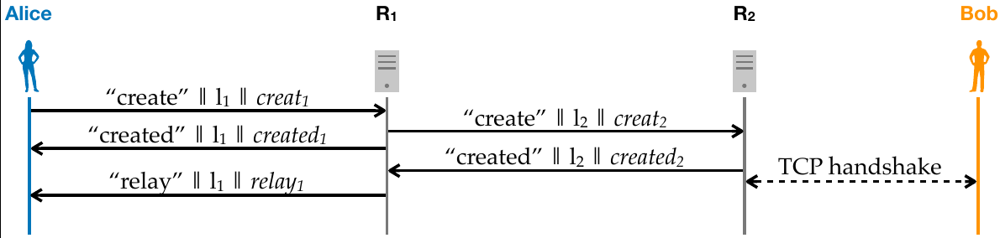
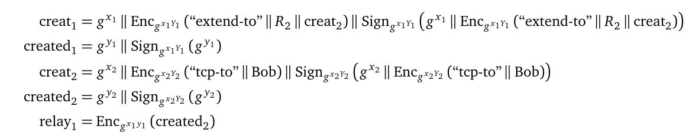

# Exercise sheet 6: Anonymous Communication Systems

*20 October 2020*

Handing in this exercise sheet is optional.
If you want individual feedback for your solutions, you have to hand in your solution by the **Wednesday following exercise publication, October 28, at 23:59**.
The hand-in procedure is as follows:

- copy this document, and answer the questions in the appropriate spaces;
- create a new issue on [the GitLab issue repo](https://gitlab.inf.ethz.ch/PRV-PERRIG/netsec-course/netsec-2020-issues);
- the issue title must be in the form `[exercise-hand-in] Exercise 6 {YOUR NETHZ ID}` (without curly braces); 
- you should set the issue as confidential;
- paste the modified document with your solution in the body of the issue. 

### Question 1 
**ACS anonymity set**  
Alice and Bob are communicating using a circuit-based anonymous
communication system (ACS).

**1.1.** (1 points)
Normally, the fact that someone is using an ACS for communication is not
hidden. In other words, by observing the Internet traffic of Alice or
Bob, it is clear that they are using a particular ACS. Explain why this
may not be considered an issue, and in what cases instead it could be a
problem.

*Solution:* Your solution here

**1.2.** (1 points)
There are systems that try to disguise their traffic as regular web
traffic (in Tor, there are so-called *pluggable transports*[1]). Name
one possible scenario where this could be useful.

[1] <https://www.torproject.org/docs/pluggable-transports.html.en>

*Solution:* Your solution here

### Question 2 (2 points)
**Malicious relay**  
You operate an ACS relay server. You think that Alice and Bob are
communicating with each other and you suspect that your server is on
their communication path.  
Assume that you can sniff the encrypted packets from/to Alice/Bob
directly on their Internet uplinks, but you cannot read the contents of
these packets as they are (onion-)encrypted.  
How can you verify whether Alice communicates with Bob over your server?
Assume you can monitor traffic in different locations and can see the
outer IP header data.

*Solution:* Your solution here

### Question 3 (2 points)
**Circumvent anonymisation**  
ETH has taken control of a dark web *carder* website, and wants to
dismantle the operation: on this website, criminals buy (stolen) credit
card numbers. All users connect using circuits with telescopic setup and
you can’t compromise their relays. After a “customer” pays for the
credit card data, a `.pdf` file with the credit card numbers is sent to
the purchaser. How can you use this to deanonymise the criminals?

*Solution:* Your solution here

### Question 4 (5 points)
**A new setup**  
In the context of circuit-based ACSes, a new setup has been proposed.
The author claims that it has the speed of a direct setup, but the
security of the telescopic setup (in particular, it is supposed to
provide perfect forward secrecy). The setup protocol is illustrated
below, shown with only two relays, *R*1 and *R*2
for simplicity. The long-term Diffie-Hellman public keys of these relays
are *g**Y*1 and *g**Y*2,
respectively. Lowercase letters denote ephemeral private keys:
*x*1 and *x*2 are ephemeral private keys generated
by the circuit initiator, while *y*1 and *y*2 are
ephemeral private keys generated by the relays *R*1 and
*R*2, respectively.

In the diagram above, *l*1 and *l*2 denote
per-link IDs, while the parts of the messages denoted by
creat1, created1, creat2,
created2, relay1, are defined as follows:

Once the circuit initiator (Alice) has received all ephemeral public
keys of the relays (*g**y*1 and
*g**y*2), she only uses the shared keys computed
based on these ephemeral public keys (i.e.,
*g**x*1*y*1 and
*g**x*2*y*2) for the rest of the
circuit’s lifetime. Argue about the correctness of the claims about this
new setup: is it really faster? Does it provide immediate forward
secrecy?

*Solution:* Your solution here

### Question 5 
**On the Internet, nobody knows you are a dog.[1] Maybe.**  
How many times have you heard about the death of online privacy? In this
exercise, we will analyze two methods that companies use to de-anonimyze
users, and we will see the impact they have on Tor browser.

[1] <https://en.wikipedia.org/wiki/On_the_Internet,_nobody_knows_you%27re_a_dog>

**5.1.** (2 points)
What is a widely used technique to track users browsing across many
websites? How can an advertising website use it to track your history?

*Solution:* Your solution here

**5.2.** (3 points)
How can you defend yourself from tracking cookies? How do hardened
browsers like the Tor Browser deal with this problem?

*Solution:* Your solution here

**5.3.** (4 points)
As time went by, companies had to get clever as research caught on with
their sneaky practices. They figured out they could create fingerprints
of users. How does it work? What information does it use? How does it
collect it and how does it hamper your privacy?

*Solution:* Your solution here

**5.4.** (1 points)
Please go to <https://amiunique.org/> and run the test. Are you unique?
What’s the global percentage of unique devices?

*Solution:* Your solution here

**5.5.** (3 points)
What could be a solution to the problem of fingerprinting? How does the
Tor Browser deal with it?

*Solution:* Your solution here

**5.6.** (3 points)
In a controversial blogpost, Google’s Chome Engineering Director
affirmed: "\[...\] large scale blocking of cookies undermine people’s
privacy by encouraging opaque techniques such as fingerprinting." [1].
Google main source of income is advertising, and their position is
understandable [2] – nevertheless, blaming privacy-conscious users for
the advent of draconian tracking measures is not going to solve any
problem. In the blogpost cited above, Google proposes some new privacy
controls aimed to leverage cookie blocking. Highlight one strength and
one weaknesses of the proposed system. Can you imagine an alternative
revenue source for content producers in an personalized-ad free
Internet?

[1] <https://www.blog.google/products/chrome/building-a-more-private-web/>

[2] <https://services.google.com/fh/files/misc/disabling_third-party_cookies_publisher_revenue.pdf>

*Solution:* Your solution here
