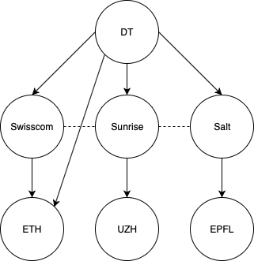
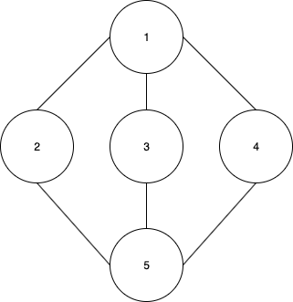

# Exercise sheet 7: Tor, BGP security

*27 October 2020*

Handing in this exercise sheet is optional.
If you want individual feedback for your solutions, you have to hand in your solution by the **Wednesday following exercise publication, November 4, at 23:59**.
The hand-in procedure is as follows:

- copy this document, and answer the questions in the appropriate spaces;
- create a new issue on [the GitLab issue repo](https://gitlab.inf.ethz.ch/PRV-PERRIG/netsec-course/netsec-2020-issues);
- the issue title must be in the form `[exercise-hand-in] Exercise 7 {YOUR NETHZ ID}` (without curly braces); 
- you should set the issue as confidential;
- paste the modified document with your solution in the body of the issue. 

### Question 1 
**Tor: Basics.**  

**1.1.** (2 points)
Exit relays often specify policies on outgoing connections. What could
be a reason for an exit relay to enforce such a policy?

They can be made responsible if they download tons of child porn

**1.2.** (1 points)
Facebook has a hidden service called “facebookcorewwwi.onion". How and
why did they get this specific URL? Why didn’t they use
“facebook.onion”?

it is not possible to choose them, they are randomly generated. So they just tried dousends of names

**1.3.** (2 points)
The directory authorities limit the number of relays per subnet. Why?

To avoid spamming
### Question 2 
**Tor: Malicious Exit Relay.**  
One of the threats against Tor is posed by malicious exit relays. If
someone accesses a website on the public (DNS-indexed) part of the
Internet, the last hop has to go through an exit relay. Because anyone
can host an exit relay, this relay can be malicious.

**2.1.** (2 points)
Assume that you access a website using HTTP on the public Internet
through the Tor network. What threat does a malicious exit relay pose?
To what extent would the use of HTTPS help in this case?

It can read/modify/repeat/drop/etc all packets
HTTPS would stop it from accessing the content of the packets, they could only be dropped/repeated

**2.2.** (2 points)
Further assume that you maintain a webserver. How could you use this
webserver to detect malicious exit relays?

Send traffic with fake sensitive content to the webserver and first check if it arrives unchanged, and second check the attacker tries to abuse it, i.e. log in to your webserver with your stolen fake credentials

**2.3.** (2 points)
Are malicious exit relays a problem when using a hidden service? Why/Why
not?

No, because for the hidden ones do not use real exit relays. They also need some kind of entry relays, because the webserver establishes the connection.

### Question 3 
**BGP: Business relationships.** This question covers the normal
operation of BGP in the absence of additional security measures for path
propagation. (You can take a look to the Networking Refresher if you
forgot everything about BGP!)  

  

This question focuses on the business relationships between different
ASes. Using the example network depicted above, answer the following questions.

**3.1.** (1 points)
ETH wants to send traffic to UZH, which path(s) are probably used and
why?

*Solution:* Your solution here

**3.2.** (1 points)
ETH wants to send traffic to EPFL, which path(s) are probably used and
why?

ETH - Swisscom - Sunrise - UZH

the most preferred links are: Provider-Customer, Peer-Peer, Customer-Provider

**3.3.** (2 points)
ETH misconfigured their BGP router, and started advertising their
connection to DT to Swisscom. What will happen to traffic from Swisscom
to Sunrise or EPFL and why?

Swisscom - ETH - DT - Salt - EPFL
Swisscom earns money if they send traffic to ETH

### Question 4 
**Common BGP Attacks, I.** Prefix hijacks are the most common attacks in
the BGP ecosystem. Attackers exploit by accident or by intention the
longest matching prefix of BGP to redirect traffic through their AS. The
list of attacks is pretty long, so we will highlight some of those in
this exercise. We actually have already seen one of those, remember the
MyEtherWallet attack on DNS?

**4.1.** 
BGPlay[1] is a fun tool used for visualizing BGP paths over time. You
can use the tool by typing in a prefix and setting start and finish date
in the options. Visualizing the following attacks can be fun!

[1] <https://stat.ripe.net/widget/bgplay>

**4.2.** 
Sometimes governments think that using BGP prefix hijacking is a great
idea. Take a look at what happened when Pakistan tried to censor Youtube
in 2008[1].

[1] <https://www.ripe.net/publications/news/industry-developments/youtube-hijacking-a-ripe-ncc-ris-case-study>

- (3 points) What happened? What were the consequences?

All Youtube traffic went to pakistan an probably just stayed there

- (3 points) How did Youtube try to counteract this problem? Why is this generally
ineffective?

They announced a same length prefix, this caused the traffic to be more or less geographically split into pakistan and original Youtube.

**4.3.** 
Often we do not know what was the purpose or the cause of the hijack.
This case[1] is another interesting case study from 2017.

[1] <https://bgpmon.net/bgpstream-and-the-curious-case-of-as12389/>

- (2 points) What happened? What were the most notable ASes involved?

Russia pulled all traffic to themselves.
Swisscom

- (2 points) Who discovered the anomalies? Which role do this kind of services have
in BGP hijacks? Was it effective in this case?

BGP Stream, they observe everything
### Question 5 
**BGP: Traffic engineering.** (You can take a look to the Networking
Refresher if you forgot everything about BGP!)  
Normally, BGP routers have multiple paths to choose from to send traffic
to a given destination. Simplified, the decision process looks as
follows (with decreasing importance):

1.  higher LOCAL-PREF: this is a value that expresses the preference of
    the AS (e.g. based on which of its customers pays more or which
    provider is cheaper)

2.  Shorter AS-Path length: Assume that shorter AS-path means shorter
    routes, which could mean faster routing which in turn leads to
    satisfied customers.

3.  lower MED: this value is set by the business partner and used to
    express his preference (e.g. that traffic should be routed over link
    A instead of link B if possible).

4.  prefer learned over eBGP instead of iBGP: prefer routes that were
    advertised directly to this router from a BGP router of another AS.
    In other words, avoid routing traffic through internal network if
    possible.

5.  smallest ingress IP address (used as tie-breaker)

The details are not of importance. This question investigates a few ways
that an AS can control inbound traffic to some degree by modifying the
AS-path. As you see at the above routing decision process, the AS-path
length appears early in the decision process.

<figure>
<figcaption aria-hidden="true">Example AS configuration</figcaption>
</figure>

**5.1.** (1 points)
When advertising a route, a BGP router can add its AS number multiple
times to the AS-path. What would be the effect and why could this be
useful? Remember that shorter AS-paths are generally preferred during
routing.

It can for example outplay the MED rule

**5.2.** (1 points)
The AS-path is used for loop detection. If a router sees that it is
already on the AS-path, it will not accept the advertisement. How can
this fact be used to avoid your traffic to be routed over a specific AS?

If I want to announce my prefix, but do not want it to be routed over DT, i just add MyAS-DT-MyAS to the AS-path

**5.3.** (2 points)
Assume the AS topology depicted above.
For this question, we ignore business relationship between ASes, and the
figure only shows connectivity between the ASes.  
Assume that AS 1 malicious and would like to eavesdrop on some traffic
that originate from ASes 3 and 4, and has their destinations in AS 5.
How should AS 1 design its routing advertisements to carry out such an
attack? Note that AS 1 only wants to eavesdrop, which means that the
hijacked traffic should still be delivered to AS 5.

It would announce the AS5 prefix to AS3 and AS4 with an empty AS-path if possible, or otherwise just with AS1 in it. It would also include a MED of 0