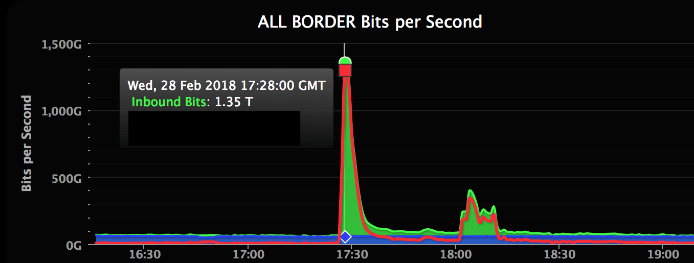

# Exercise sheet 8: BGP security, DoS

*05 November 2020*

Handing in this exercise sheet is optional.
If you want individual feedback for your solutions, you have to hand in your solution by the **Thursday following exercise publication, November 14, at 23:59**.
The hand-in procedure is as follows:

- copy this document, and answer the questions in the appropriate spaces;
- create a new issue on [the GitLab issue repo](https://gitlab.inf.ethz.ch/PRV-PERRIG/netsec-course/netsec-2020-issues);
- the issue title must be in the form `[exercise-hand-in] Exercise 8 {YOUR NETHZ ID}` (without curly braces); 
- you should set the issue as confidential;
- paste the modified document with your solution in the body of the issue. 

### Question 1 
**BGP: BGPSec.**  

**1.1.** (2 points)
What security problems is BGP facing?

**Solution**:
Lack of authentication for advertisements, and lack of verification of
the advertised information. Slow convergence makes it hard to provide
availability guarantees on the Internet.

**1.2.** (4 points)
What is route origin authorization? Briefly explain how it works and
against what attacks it is effective.

**Solution**:
"A ROA is a cryptographically signed object that states which Autonomous
System (AS) is authorized to originate a particular IP address prefix or
set of prefixes."

ROAs are used in the context of the Resource Public Key Infrastructure
(RPKI), in an attempt to mitigate the fact that in BGP, advertised routes
are not authenticated.

The RPKI is run by the Regional Internet Registries (RIRs), which issue
certificates for IP prefixes and AS numbers. Holders of an address space
can then create ROAs, signed with their certificate, attesting that they
are allowed to advertise the prefix in question.

ROAs are published, and BGP routers that receive a route advertisement 
can check whether there exists a ROA matching that prefix. If so, the 
advertisement is valid if the AS number advertising the prefix matches
the AS number in the ROA, and invalid otherwise.
Note that if there is no ROA for a prefix, the validation status is
'unknown', and the AS can still accept the advertisement, allowing for
incremental deployment of Origin Verification.

**1.3.** (2 points)
Why is it not possible for a malicious AS to add another AS to a path in
BGPSec?

**Solution**:
In vanilla BGP, the path vector is built step-by-step: each AS adds its
own AS number in the path when propagating a BGP update.

In BGPSec, the process is the same, but each AS also includes the AS number
the update is sent to, and the information added to the as path is signed.

A malicious AS 'E', targeting a victim AS 'V', will now need a signature
form 'V' for it to be inserted in a BGP path.

### Question 2 
**BGP: Common BGP Attacks II.**

**2.1.** (2 points)
BGP border routers use TCP sessions to reliably exchange routing
advertisements, and this can become an attack surface to disrupt BGP
routers. Specifically, an attacker sends the spoofed RST packet to close
the TCP connection between two border routers, and the two routers
delete advertisements learned from each other. At a later time, the two
routers establish the TCP session again; however, there could be some
delay before any data traffic are passed on the link between the two
routers. What could have caused this delay, and how would you mitigate
the TCP connection reset attack?

**Solution**:
After reestablishing the connection, routers need to exchange BGP route
advertisements again. They will need to wait for the routes to propagate.

A possible mitigation is to establish a trust boundary and allow sensitive
packets only from trusted sources (eg. edge routers should implement ingress
filtering, limit the interfaces the BGP daemon is listening on, etc. )

**2.2.** (1 points)
Imagine that in the previous example, the routers started using BGPSec.
Unfortunately, admins haven’t fixed the vulnerability, so the adversary
performs the same attack. Now the time between establishment of
connections jumps to several seconds. Explain why.

**Solution**:
Routers will need to verify all the signatures for the routes they receive,
and at they will also need to produce new signature for the outgoing BGP
updates.
The additional delay can be attributed to the public cryptography operations,
which can be especially slow on the (limited) hardware many Internet routers
run on top.

**2.3.** (1 points)
When making forwarding decisions, BGP routers use longest prefix
matching (LPM). For example, if you have both 1.1.0.0/16 and 1.1.1.0/24
in your routing table, you will use the route indicated by the latter
entry when sending the packet to 1.1.1.1. In order to prevent route
hijacking, every AS could announce the route for every IP address. Why
is this a bad idea?

**Solution**:
Even if we do this, the routes could be aggregated again in surrounding
routers. If we presume that it isn’t the case, the routing tables would
be too big and impossible to search through efficiently. Furthermore,
every time a BGP connection is established, all that data would need to
be exchanged between the routers. Finally, without any aggregation the
size of routing tables would grow to the size of the whole IP address
space: approximately 2<sup>32</sup>, or 4 billion, entries. Routers have
to process packets at line rate, and routing-table lookups have to be
fast. To achieve the desired rates, tables are implemented as expensive
TCAMs (ternary content-addressable memory), and the biggest and most
expensive routers have less than 1 million entries available. Therefore,
1 entry per-address is not technically and economically feasible today.

### Question 3 
**DDoS: GitHub.**  

Github’s sustained an infamous 1.35Tbps DDoS attack in 2018[1].

 <span
id="fig:github" label="fig:github">\[fig:github\]</span>

[1] <https://github.blog/2018-03-01-ddos-incident-report/>

**3.1.** (3 points)
How does this attack compare with the 2015 DDoS by the Chinese Great
Firewall[1]? Which one do you believe was harder to counter?

[1] <https://citizenlab.ca/2015/04/chinas-great-cannon/>

**Solution**:
The 2018 attack was a purely volumetric attack – it used memcached as
amplification vector.

The 2015 attack was also an application layer attack – all of the attack
traffic was comprised of seemingly legitimate HTTP requests. This
probably made it much more complex to counter – on the other hand, this
kind of attack does not benefit of amplification factors, so it is more
difficult for an attacker to realize.

**3.2.** (3 points)
To mitigate the attack, Github stopped announcing some of its BGP
routes. Why was that effective? Which routes were instead kept?

**Solution**:
Github (who has its own AS, 36459) has connectivity through multiple
providers – during the DDoS, they withdrew BGP announcements form all
neighbour ASs, except AS 32787. AS 32787 is run by Prolexic, a 
subsidiary of Akamai, which offers a DDoS mitigation platform.

This allowed Prolexic to act as a shield for the attack: Akamai
infrastructure absorbed all of the load and filtered memchached traffic,
only forwarding legitimate traffic to Github.
<https://blogs.akamai.com/2018/03/memcached-fueled-13-tbps-attacks.html>

### Question 4 
**DDoS: DNS.**  

DDoS attacks are always very tricky to mitigate: they tend to also
exhaust the bandwidth of uplinks (or even entire ISPs), rendering local
countermeasures futile. DNS servers (used to) enable a very interesting
type of DDoS attack. On March 18 2013 an anti-spam-mail organization,
Spamhaus, experienced an DDoS of bandwidth unheard of before then – 75
Gbps[1].

[1] <https://blog.cloudflare.com/the-ddos-that-knocked-spamhaus-offline-and-ho/>,
(note that more modern DDoS reached several Tbps)

**4.1.** (1 points)
How does a DNS reflection attack work?

**Solution**:
An attacker sends a request to a DNS server with spoofed IP address. The
DNS will reply to the machine that actually has the spoofed IP address,
which will not be expecting traffic coming to it.

**4.2.** (2 points)
Can you give an example of a DNS query which would trigger a big response?

**Solution**:
Same as before, but using a request that triggers a much larger
response. Examples of such queries are the ANY queries, which return all
the DNS records of a domain, including the lengthy SOA records.
(`dig @X.X.X.X ANY ripe.net +edns=0 +bufsize=4096`)

Note that most DNS recursive resolver and authoritative servers will nowadays
refuse to respond ANY queries, or will greatly limit the size of their responses,
in order to limit the amplification factor.

**4.3.** (2 points)
In this case attackers probably used a request that is \~30 bytes long, 
which resulted in a \~3000 bytes response. What is the amplification factor? 
How much bandwidth did the attackers use to perform the attack?

**Solution**:
```math
amp\_fac=\frac{3000b}{30b} = 100\\
75 000~\frac{\texttt{Mb}}{s} = 100 \times input\_bw\\
input\_bw = 750~\frac{\texttt{Mb}}{s}
```

**4.4.** (3 points)
DNS (mainly) uses UDP port 53. Why does using UDP enable this attack? Can 
you perform it with a TCP-based protocol, assuming Dolev-Yao attacker?

**Solution**:
UDP is a fire-and-forget protocol, with no added overhead. So, the DNS
server just replies to the spoofed IP address with no further checks. On
TCP this attack would not work as-is, as the data sent by the server
would be the second message in the TCP handshake. However, the attacker
could reply with the third handshake message + payload after
intercepting the replies and dropping them. If the attacker is not
Dolev-Yao, which is often the case, the attack would become tricky to
perform.

**4.5.** (2 points)
What is an open recursive DNS resolver? How can you configure it to
mitigate DNS reflection&amplification attacks?

**Solution**:
An open DNS recursive resolver replies to any DNS query, coming from any
device on the Internet. This can be a problem, given the amplification
factor of a DNS query. A solution would be to rate-limit resolved
requests by IP, so that no machine would be overwhelmed with data. But
usually attacks do not use one single server.  
Another solution would be to limit the IP subnets that can access the
server to the ISPs known to prevent source address spoofing.

**4.6.** (2 points)
How can such a DDoS attack be stopped?

**Solution**:
One possible mitigation is hosting a service on different physical
locations: it gets harder for an attacker to saturate multiple network
paths.

Using anycast, the same IP address is advertised on different locations
on the internet. A user is directed to the nearest service location.
This helps to distribute the load on different networks. Some CDN
providers like Akamai or CloudFlare offer this as a service: this attack
was actually stopped by CloudFlare.  
This has implications, namely that an individual or single company can’t
really have protection against DDoS without using an external service,
through which its entire traffic has to pass.
