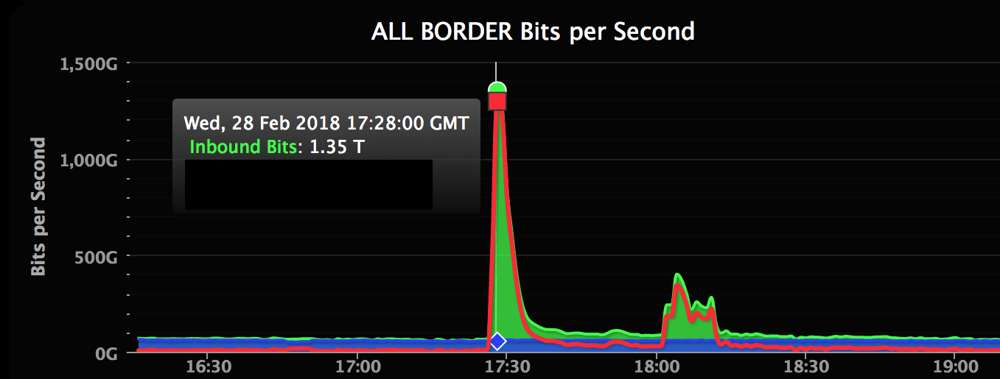

# Exercise sheet 8: BGP security, DoS

*05 November 2020*

Handing in this exercise sheet is optional.
If you want individual feedback for your solutions, you have to hand in your solution by the **Thursday following exercise publication, November 14, at 23:59**.
The hand-in procedure is as follows:

- copy this document, and answer the questions in the appropriate spaces;
- create a new issue on [the GitLab issue repo](https://gitlab.inf.ethz.ch/PRV-PERRIG/netsec-course/netsec-2020-issues);
- the issue title must be in the form `[exercise-hand-in] Exercise 8 {YOUR NETHZ ID}` (without curly braces); 
- you should set the issue as confidential;
- paste the modified document with your solution in the body of the issue. 

### Question 1 
**BGP: BGPSec.**  

**1.1.** (2 points)
What security problems is BGP facing?

*Solution:* Your solution here

**1.2.** (4 points)
What is route origin authentication? Briefly explain how it works and
against what attacks it is effective.

*Solution:* Your solution here

**1.3.** (2 points)
Why is it not possible for a malicious AS to add another AS to a path in
BGPSec?

*Solution:* Your solution here

### Question 2 
**BGP: Common BGP Attacks II.**

**2.1.** (2 points)
BGP border routers use TCP sessions to reliably exchange routing
advertisements, and this can become an attack surface to disrupt BGP
routers. Specifically, an attacker sends the spoofed RST packet to close
the TCP connection between two border routers, and the two routers
delete advertisements learned from each other. At a later time, the two
routers establish the TCP session again; however, there could be some
delay before any data traffic are passed on the link between the two
routers. What could have caused this delay, and how would you mitigate
the TCP connection reset attack?

*Solution:* Your solution here

**2.2.** (1 points)
Imagine that in the previous example, the routers started using BGPSec.
Unfortunately, admins haven’t fixed the vulnerability, so the adversary
performs the same attack. Now the time between establishment of
connections jumps to several seconds. Explain why.

*Solution:* Your solution here

**2.3.** (1 points)
When making forwarding decisions, BGP routers use longest prefix
matching (LPM). For example, if you have both 1.1.0.0/16 and 1.1.1.0/24
in your routing table, you will use the route indicated by the latter
entry when sending the packet to 1.1.1.1. In order to prevent route
hijacking, every AS could announce the route for every IP address. Why
is this a bad idea?

*Solution:* Your solution here

### Question 3 
**DDoS: GitHub.**  

Github’s sustained an infamous 1.35Tbps DDoS attack in 2018[1].

 \[fig:github\]

[1] <https://github.blog/2018-03-01-ddos-incident-report/>

**3.1.** (3 points)
How does this attack compare with the 2015 DDoS by the Chinese Great
Firewall[1]? Which one do you believe was harder to counter?

[1] <https://citizenlab.ca/2015/04/chinas-great-cannon/>

*Solution:* Your solution here

**3.2.** (3 points)
To mitigate the attack, Github stopped announcing some of its BGP
routes. Why was that effective? Which routes were instead kept?

*Solution:* Your solution here

### Question 4 
**DDoS: DNS.**  

DDoS attacks are always very tricky to mitigate: they tend to also
exhaust the bandwidth of uplinks (or even entire ISPs), rendering local
countermeasures futile. DNS servers (used to) enable a very interesting
type of DDoS attack. On March 18 2013 an anti-spam-mail organization,
Spamhaus, experienced an DDoS of bandwidth unheard of before then – 75
Gbps[1].

[1] <https://blog.cloudflare.com/the-ddos-that-knocked-spamhaus-offline-and-ho/>,
(note that more modern DDoS reached several Tbps)

**4.1.** (1 points)
How does a DNS reflection attack work?

*Solution:* Your solution here

**4.2.** (2 points)
Can you give an example of a DNS query which would trigger a big response?

*Solution:* Your solution here

**4.3.** (2 points)
In this case attackers probably used a request that is \~30 bytes long, 
which resulted in a \~3000 bytes response. What is the amplification factor? 
How much bandwidth did the attackers use to perform the attack?

*Solution:* Your solution here

**4.4.** (3 points)
DNS (mainly) uses UDP port 53. Why does using UDP enable this attack? Can 
you perform it with a TCP-based protocol, assuming Dolev-Yao attacker?

*Solution:* Your solution here

**4.5.** (2 points)
What is an open recursive DNS resolver? How can you configure it to
mitigate DNS reflection&amplification attacks?

*Solution:* Your solution here

**4.6.** (2 points)
How can such a DDoS attack be stopped?

*Solution:* Your solution here
