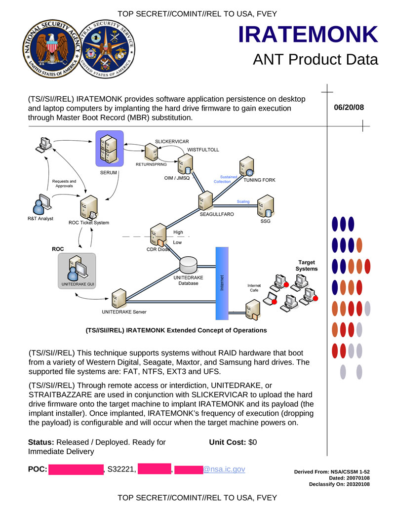

# Exercise sheet 9: Mirai, Stuxnet

*11 November 2020*

Handing in this exercise sheet is optional.
If you want individual feedback for your solutions, you have to hand in your solution by the **Wednesday following exercise publication, November 18, at 23:59**.
The hand-in procedure is as follows:

- copy this document, and answer the questions in the appropriate spaces;
- create a new issue on [the GitLab issue repo](https://gitlab.inf.ethz.ch/PRV-PERRIG/netsec-course/netsec-2020-issues);
- the issue title must be in the form `[exercise-hand-in] Exercise 8 {YOUR NETHZ ID}` (without curly braces); 
- you should set the issue as confidential;
- paste the modified document with your solution in the body of the issue. 

### Question 1 
Starting from September 2016, a wave of huge DDoS attacks hit the world
by hand of a new botnet called Mirai ("Future" in Japanese). In this
exercise, we will analyze in detail various aspects of this particular
botnet. Note that, in order to answer some of these questions correctly,
you need to do some additional reading.

<figure>
<figcaption aria-hidden="true">Front cover of Shimoneta, a japanise light novel. The author of the Mirai malware borrowed names and pseudonyms from animes and light novels. His messy operational security allowed security researcher Brian Krebs to identify him.</figcaption>
</figure>

.

**1.1.** (3 points)
What are the components of a basic botnet and what is their function?

**Solution**:
1.  Command and Control infrastructure: often owned by the attackers, is
    it used to push commands to the bots.

2.  Zombies: devices under control of the attackers – often vulnerable
    hosts that have been infected with a malware.

3.  Bot: software that contains the malicious business logic

**1.2.** (1 points)
What kind of attacks were vectored through Mirai botnet? Who were the
targets and what was the approximate bandwidth consumed?

**Solution**:
Mirai has been used mainly for Distributed Denial of Service attacks.
The main attacks were done against OVH, Krebs on Security blog (whose
author investigated Mirai), Dyn DNS. Traffic peaks were between 640
Gbit/s and 1Tbit/s.

**1.3.** (1 points)
From an attacker’s perspective, why is it much better to launch a
distributed attack?

**Solution**:
A DDoS is much harder to track and take down than a regular DoS. This
allows the attacker to hide his identity behind the botnet.  
Additionally, a DDoS enables the attacker to have a virtually unlimited
bandwidth for flood attacks.

**1.4.** (3 points)
Mirai spread very quickly because of a particular choice of target
devices. What are these devices? Why was it so quick? What kind of
"vulnerability" does the botnet exploit?

**Solution**:
Mirai mainly targeted IoT devices. The number of operating IoT devices
was 10 billion in 2019, almost as many as mobile phones. This fact makes
them a very interesting for an attacker, and a very quick diffusion
vector. Moreover, these devices are configure-and-forget, so owners
don’t usually realise their devices have been compromised. In
particular, the “vulnerability” that enabled Mirai to spread was the
fact that many people leave default credentials in the configuration,
assuming their devices will never be compromised.  
Would you ever think that your microwave oven is launching a DDoS
attack?

**1.5.** (4 points)
You have a Mirai-infected device in your network. Describe how the
botnet can spread by infecting new victims.

**Solution**:
1.  Scan: the infected device goes into scan mode and looks for open
    Telnet ports. It does so by sending TCP-SYN packets to randomly
    generated IPv4 addresses. The generation algorithm strategically
    excludes some addresses, like the ones assigned to the USA
    Department of Defense.

2.  Brute force: the bot tries to log in using 10 random user/pass
    combinations taken from a hardcoded list of 62. These represent
    default credentials of existing devices.

3.  Report: upon login success, the bot reports the target to a Report
    Server. It lists IP address, type of device (if available) and
    successful credentials.

4.  Infection: a Loader program gets a detail of the target from the
    Report Server, connects to Telnet and uploads the correct malware
    binary to the machine.

**1.6.** (2 points)
What happens when a Mirai-infected device is rebooted? Motivate this
malware design decision.

**Solution**:
Mirai is non-persistent: the binary is loaded into memory and
immediately deleted from disk. Rebooting will remove the malware, but
the device can still be reinfected.

Many pieces of malicious software are designed to be non-persistent:
this makes detection and forensic analysis more difficult, the software
may remain undetected for longer. In the case of compromised IoT
devices, for example, accessing the device via remote shell might be
difficult, and a non-persistent infection would make offline analysis
useless.

**1.7.** (2 points)
\[Bonus\] The first step in analyzing a networked attack is figuring
out, given packet dumps of a link, how to differentiate between benign
and malicious traffic. How did researchers fingerprint the network scan
packets generated by Mirai? What is the probability of a natural
occurrence of that regularity?

**Solution**:
Every probe packet generated by Mirai had the sequence number (32 bit)
equal to the IP address of the scanned device. Since the probability of
that naturally occurring is $\\frac{1}{2^{32}}$, researchers were able
to mark Mirai traffic with little to none false positives.

### Question 2 
The Internet keeps evolving – it is no longer the Cyberspace whose
independence John Perry Barlow defended in 1996: governments, economic
powers, social structures are now all reflected in the Net. So is war.
**Stuxnet**[1] is the first (publicly know) cyberweapon – a complex
malware, widely believed to have targeted uranium enrichment
infrastructure in Iran[2] – and, according to many, a turning point in
the history of the Internet[3].

<figure>
<figcaption aria-hidden="true">A document from NSA’s cyber-warfare unit, “TAO”, describing a malware which achieves persistence on target systems by infecting hard drive firmware. <a href="https://en.wikipedia.org/wiki/NSA_ANT_catalog">https://en.wikipedia.org/wiki/NSA_ANT_catalog</a> </figcaption>
</figure>

[1] <https://web.archive.org/web/20200224222932/https://www.symantec.com/content/en/us/enterprise/media/security_response/whitepapers/w32_stuxnet_dossier.pdf>

[2] <https://fas.org/sgp/crs/natsec/R41524.pdf>

[3] \[fn:langner\]
<https://www.langner.com/wp-content/uploads/2017/03/to-kill-a-centrifuge.pdf>

**2.1.** 
Stuxnet is now 10 years old, but, even at the time of its release, it
did not use bleeding edge obfuscation techniques[1].

[1] <https://rdist.root.org/2011/01/17/stuxnet-is-embarrassing-not-amazing/>,
read Ralph Langner report for the reasons why this made sense

- (2 points) Why was it not detected by antivirus software?

**Solution**:
Antivirus software only provides protection against known threats – even
modern AV techniques, like heuristic evaluation of suspicious behaviour,
would be pretty pointless against any serious piece of malware.

- (2 points) What happened during installation when Stuxnet detected an antivirus
program running in the target system?

**Solution**:
Stuxnet often injected itself into the privileged antivirus process to
ease the infection. Depending on the antivirus, it alternatively ignored
it and injected itself in a Windows system process.

- (2 points) Would you install antivirus software on the air-gapped computers in a
critical industrial system? Provide arguments for your answer.

**Solution**:
An antivirus in a critical, air-gapped system is probably a bad call.
Such a system should never be exposed to any threat recognizable by an
antivirus: this defense would definitively be too little, too late.
Furthermore:

-   It would be hard for the antivirus to update its signature database
    in the air gap.

-   The antivirus is likely to increase attack surface – many
    devastating antivirus vulnerabilities have been found in the recent
    years.

-   An antivirus has the capability to disrupt normal operation of the
    software, delaying system calls or IO – this would be unacceptable
    on a critical system.

Side note: Zerodium, a startup that offer cash prizes for exploits, only
offers $10k for a Local Privilege Escalation on antiviruses, while a
similar vulnerability in the native OS would pay 8 times more. For
Remote Code Execution, the price difference is 20-fold ($50k vs $1M). An
RCE on Adobe products or WinRAR is also more expensive than an antivirus
one. <https://zerodium.com/program.html>.

**2.2.** (4 points)
How did Stuxnet spread? Consider today’s Internet, infosec, and the way
you communicate and share files: propose some new infection vectors.

**Solution**:
Stuxnet infection vectors included:

-   Network: WinCC machines, network shares, MS10-061 Print Spooler
    zero-day, MS08-067 Windows Server Service vulnerability.

-   Removable drives, to jump airgaps: LNK vulnerability, `autorun.inf`.

Currently, it is much more common to use instant messaging services and
cloud shares rather than usb drives. A modern malware could spread
trough those channels. Furthermore, firmware exploits on Bluetooth, WiFi
and cellular radio chips have been developed (e.g.
<https://www.kb.cert.org/vuls/id/166939/>) – those, combined with the
ubiquity of smartphones, could be used to jump air gaps. Another
possible (and currently exploited) idea is compromising package managers
like npm.

**2.3.** 
Persistence – the ability to survive reboots, updates, or even wipe-outs
– is an important part of many malwares. In the case of espionage and
surveillance, this is of capital importance (see figure
<a href="#fig:iratemonk" data-reference-type="ref" data-reference="fig:iratemonk">[fig:iratemonk]</a>).
In some cases, like the Mirai botnet, it can be an undesirable property.

- (3 points) How did Stuxnet achieve boot persistence? Which kind of removal attempts
would the malware survive? Compare with `IRATEMONK`.

**Solution**:
It installed a driver, signed with a legitimate Realtek certificate.
This driver intercepts I/O requests, making the files installed by the
malware invisible. It also registers as a boot start service, acting as
load point at reboots.

This driver behaves very much like a legitimate Windows driver: this,
and its legitimate Realtek signature, make it very hard to detect even
for an experienced sysadmin. Stuxnet would survive manual inspection, OS
updates and antivirus scans. Unlike IRATEMONK, it would not survive an
hard disk wipe or an operating system reinstallation.

- (2 points) Why were signed certificates needed? How would you obtain a rogue
certificate for a malware you develop?

**Solution**:
The driver needed not raise suspicion, and while it could probably have
silently installed itself by modifying the OS, surviving system updates
would become harder. Hiding in plain sight is often a winning strategy.

Obtaining a rogue x509 certificate essentially boils down to either:

-   running a Certificate Authority – very expensive and leaves many
    traces.

-   stealing the certificate – physically (that’s how Stuxnet is
    suspected to have obtained its certificates), via cyber attacks, or
    even trough other malwares (like Zeus).

**2.4.** 
Stuxnet is very complex, carefully engineered to produce constant but
hard to notice damage to uranium enrichment centrifuges. Note that the
attack is tailored for the specific hardware and construction of the
top-secret Iranian Natanz nuclear facility: the most expensive part of
the malware was, probably, its payload and the relative testing (which
might have required a scale copy of the enrichment
plant)<a href="#fn:langner" data-reference-type="ref" data-reference="fn:langner">[fn:langner]</a>.
Consider now instead only the software exploit part.

- (2 points) What kind of resources would you need to develop a similar malware?
Would you need to be a nation-state? Argue with real-world examples.

**Solution**:
The “carrier” part of the Stuxnet malware is still quite sophisticated
and expensive, but accessible for any big corporation, or for agents
with a sufficient amount of founds – not necessarily nation-states.

There are many private cyber intelligence firms: the Israeli NSO group
and the Italian Hacking Team both developed highly sophisticated
espionage malware that was sold to governments, regimes and police
forces. Furthermore they are both known to have used zero-day exploits.
One could argue that those actors are still state-sponsored –
interestingly, what is believed to be a lone hacker, going by the
nickname “Phineas Fisher”, managed to single-handedly breach Hacking
Team infrastructure – his own report of the spectacular action can be
read at <https://archive.is/PW5Ei>.

- (2 points) What are the most expensive components you would need? Can you give a
cost estimate for those components? Cite your sources.

**Solution**:
A few hundreds hours for programming and testing
(<https://www.glassdoor.com/Salaries/programmer-salary-SRCH_KO0,10.htm>)
and cost for infrastructure (<https://www.ovh.com/world/vps/>) would be
eclipsed by the cost of zero day exploits and fake certificates.

A Windows Local Privilege Escalation like the ones used by Stuxnet sells
for $80.000 on Zerodium (<https://zerodium.com/program.html>). Remote
code execution (good for spreading) can cost anywhere between $100k and
$1M.

Running a CA to sign software could cost in the order of $150k/year
(<https://serverfault.com/questions/161289/cost-of-getting-in-house-certificate-authority-trusted>);
it is hard to find reputable sources for the price of stolen
certificates, but $20k could be a (personal) fair estimate.

- (3 points) In the light of Stuxnet and of the previous answers, which measures
would you take to protect your personal Uranium Enrichment Plant?

**Solution**:
Anything from gluing the USB ports to running SEL4 instead of MS Windows
on your workstations, using emulated system to pre-stage and visualize
turbine programming, adding code authentication capabilities to the
turbine controllers etc.
