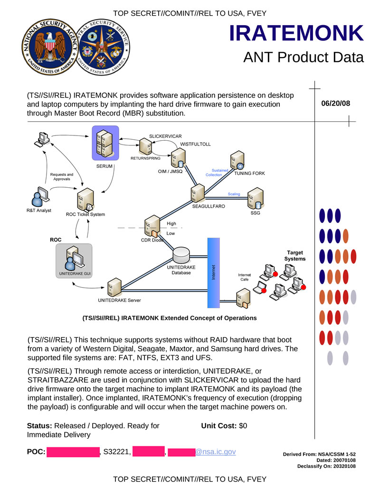

# Exercise sheet 9: Mirai, Stuxnet

*11 November 2020*

Handing in this exercise sheet is optional.
If you want individual feedback for your solutions, you have to hand in your solution by the **Wednesday following exercise publication, November 18, at 23:59**.
The hand-in procedure is as follows:

- copy this document, and answer the questions in the appropriate spaces;
- create a new issue on [the GitLab issue repo](https://gitlab.inf.ethz.ch/PRV-PERRIG/netsec-course/netsec-2020-issues);
- the issue title must be in the form `[exercise-hand-in] Exercise 9 {YOUR NETHZ ID}` (without curly braces); 
- you should set the issue as confidential;
- paste the modified document with your solution in the body of the issue. 

### Question 1 
Starting from September 2016, a wave of huge DDoS attacks hit the world
by hand of a new botnet called Mirai ("Future" in Japanese). In this
exercise, we will analyze in detail various aspects of this particular
botnet. Note that, in order to answer some of these questions correctly,
you need to do some additional reading.

<figure>
<figcaption aria-hidden="true">Front cover of Shimoneta, a japanise light novel. The author of the Mirai malware borrowed names and pseudonyms from animes and light novels. His messy operational security allowed security researcher Brian Krebs to identify him.</figcaption>
</figure>

.

**1.1.** (3 points)
What are the components of a basic botnet and what is their function?

*Solution:* Your solution here

**1.2.** (1 points)
What kind of attacks were vectored through Mirai botnet? Who were the
targets and what was the approximate bandwidth consumed?

*Solution:* Your solution here

**1.3.** (1 points)
From an attacker’s perspective, why is it much better to launch a
distributed attack?

*Solution:* Your solution here

**1.4.** (3 points)
Mirai spread very quickly because of a particular choice of target
devices. What are these devices? Why was it so quick? What kind of
"vulnerability" does the botnet exploit?

*Solution:* Your solution here

**1.5.** (4 points)
You have a Mirai-infected device in your network. Describe how the
botnet can spread by infecting new victims.

*Solution:* Your solution here

**1.6.** (2 points)
What happens when a Mirai-infected device is rebooted? Motivate this
malware design decision.

*Solution:* Your solution here

**1.7.** (2 points)
\[Bonus\] The first step in analyzing a networked attack is figuring
out, given packet dumps of a link, how to differentiate between benign
and malicious traffic. How did researchers fingerprint the network scan
packets generated by Mirai? What is the probability of a natural
occurrence of that regularity?

*Solution:* Your solution here

### Question 2 
The Internet keeps evolving – it is no longer the Cyberspace whose
independence John Perry Barlow defended in 1996: governments, economic
powers, social structures are now all reflected in the Net. So is war.
**Stuxnet**[1] is the first (publicly know) cyberweapon – a complex
malware, widely believed to have targeted uranium enrichment
infrastructure in Iran[2] – and, according to many, a turning point in
the history of the Internet[3].

<figure>
<figcaption aria-hidden="true">A document from NSA’s cyber-warfare unit, “TAO”, describing a malware which achieves persistence on target systems by infecting hard drive firmware. <a href="https://en.wikipedia.org/wiki/NSA_ANT_catalog">https://en.wikipedia.org/wiki/NSA_ANT_catalog</a> </figcaption>
</figure>

[1] <https://web.archive.org/web/20200224222932/https://www.symantec.com/content/en/us/enterprise/media/security_response/whitepapers/w32_stuxnet_dossier.pdf>

[2] <https://fas.org/sgp/crs/natsec/R41524.pdf>

[3] \[fn:langner\]
<https://www.langner.com/wp-content/uploads/2017/03/to-kill-a-centrifuge.pdf>

&nbsp;

**2.1.** 
Stuxnet is now 10 years old, but, even at the time of its release, it
did not use bleeding edge obfuscation techniques[1].

[1] <https://rdist.root.org/2011/01/17/stuxnet-is-embarrassing-not-amazing/>,
read Ralph Langner report for the reasons why this made sense

- (2 points) Why was it not detected by antivirus software?

*Solution:* Your solution here

- (2 points) What happened during installation when Stuxnet detected an antivirus
program running in the target system?

*Solution:* Your solution here

- (2 points) Would you install antivirus software on the air-gapped computers in a
critical industrial system? Provide arguments for your answer.

*Solution:* Your solution here

**2.2.** (4 points)
How did Stuxnet spread? Consider today’s Internet, infosec, and the way
you communicate and share files: propose some new infection vectors.

*Solution:* Your solution here

**2.3.** 
Persistence – the ability to survive reboots, updates, or even wipe-outs
– is an important part of many malwares. In the case of espionage and
surveillance, this is of capital importance (see figure
<a href="#fig:iratemonk" data-reference-type="ref" data-reference="fig:iratemonk">[fig:iratemonk]</a>).
In some cases, like the Mirai botnet, it can be an undesirable property.

- (3 points) How did Stuxnet achieve boot persistence? Which kind of removal attempts
would the malware survive? Compare with `IRATEMONK`.

*Solution:* Your solution here

- (2 points) Why were signed certificates needed? How would you obtain a rogue
certificate for a malware you develop?

*Solution:* Your solution here

**2.4.** 
Stuxnet is very complex, carefully engineered to produce constant but
hard to notice damage to uranium enrichment centrifuges. Note that the
attack is tailored for the specific hardware and construction of the
top-secret Iranian Natanz nuclear facility: the most expensive part of
the malware was, probably, its payload and the relative testing (which
might have required a scale copy of the enrichment
plant)<a href="#fn:langner" data-reference-type="ref" data-reference="fn:langner">[fn:langner]</a>.
Consider now instead only the software exploit part.

- (2 points) What kind of resources would you need to develop a similar malware?
Would you need to be a nation-state? Argue with real-world examples.

*Solution:* Your solution here

- (2 points) What are the most expensive components you would need? Can you give a
cost estimate for those components? Cite your sources.

*Solution:* Your solution here

- (3 points) In the light of Stuxnet and of the previous answers, which measures
would you take to protect your personal Uranium Enrichment Plant?

*Solution:* Your solution here
